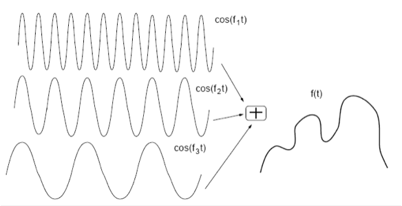
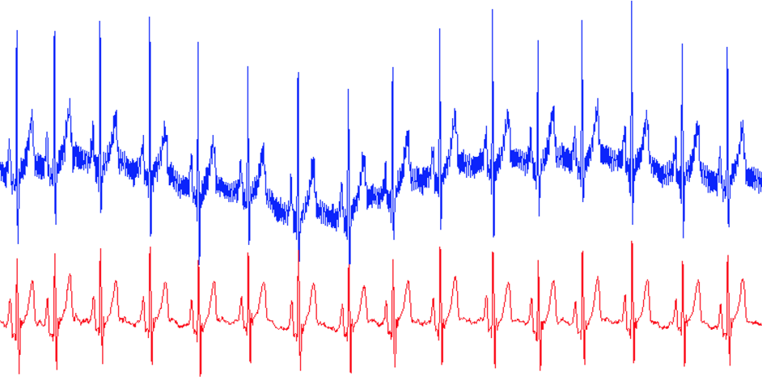
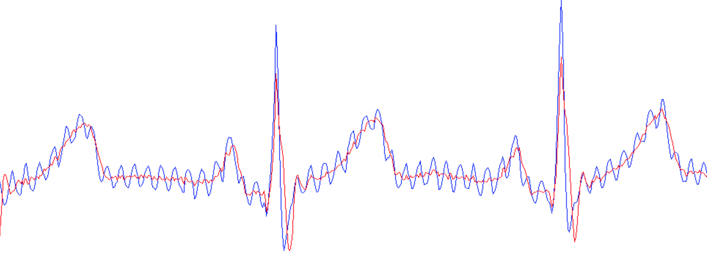

## Table of Contents
{: .no_toc .text-delta }

1. TOC
{:toc}
---

## Frequency-domain Filtering

We have discussed how to remove time-domain noise, now let us turn to noise in the frequency domain. 

### How frequency domain filtering works

A long time ago, French scientist and mathematician Jean Baptiste Fourier (1768–1830) proved the mathematical fact that any periodic waveform can be expressed as the sum of an infinite set of sine waves. The frequencies of these sine waves must be integer multiples of some period. An example of this observation is shown in Figure 4. You take two periodic sine waves, add them up, and you get a complicated looking curve. The inverse is also true. You can take any time-series pattern and break it down into a weighted sum of sinusoidal waves.



_Figure 1:  What happens if we add a number of sine waves together, with some weights for each wave? We end up with a complicated waveform that is the summation of the individual waves._

What does all of this have to do with smoothing signals? A whole lot as it turns out. The main idea is that noise in these waveforms are often concentrated in some frequencies, and not in others. For example, take the case of the accelerometer walking data in Figure 1. The rate at which you walk is typically one or two steps a second; even if you run, the step rate is a few steps a second. So the frequency of interest is only a few Hz.  Similarly, in the case of ECG, the useful frequencies of the electrical signals in the heart are between 0.5 - 150 Hz. In both cases, the frequencies of interest are limited to a relatively small range.

Here’s the magic: _once you convert a signal to a weighted sum of sinusoidals, you can just remove all the sinusoidals whose periods are outside the range that you expect, and what you are left with is a much cleaner signal! _This core idea is that by converting data from the time-domain (which we normally look at) to the frequency domain (which is this new way of viewing data as sinusoidals), we can more easily distinguish the useful data from noise and remove the noise.


### Types of Frequency-domain Filters


_Figure 2: Types of frequency-domain filters_

Figure 2 shows four types of frequency-domain filters that are commonly used in practice:


* **Low-pass filter**: A low-pass filter passes signals with frequency lower than a certain cutoff frequency and attenuates (i.e. reduces the effect of) signals that are higher than the cutoff frequency. An example where a low-pass filter is used is to remove baseline variations in an ECG signal
* **High-pass filter**: A high-pass filter passes signals with frequency higher than a cutoff frequency and attenuates signals that are lower than the cutoff. An example where a high-pass filter is used is to remove hand shaking and external vibrations from an ECG signal.
* **Bandpass filter**: A bandpass filter allows signals between certain frequencies to pass through but attenuates signals outside this band. An example of use of a bandpass filter is to look at frequencies corresponding to normal walking from an accelerometer signal.
* **Notch filter**: A notch filter attenuates the signal within a very small band but lets the other frequencies go through unaltered. An example of use of a notch filter is to remove powerline interference from an ECG signal.

In practice, one has to be careful about how to use the above filters. In many practical situations, removing frequencies abruptly causes unwanted artifacts in the signal. For example, some of you might have seen a ringing sound when you listen to percussion instruments in a concert. This topic is more involved and you can learn these in more advanced classes.


### Example: ECG Noise Removal

A classic example of how these frequency domain filters are used for noise removal is in the case of ECG filtering, so let us discuss how this works. Figure 8 shows an example of the raw ECG data and the filtered ECG data that we would like to extract from it. There are three sources of noise in the ECG data shown in this picture:




_Figure 3: (top) ECG signal with baseline wander, powerline interference, and other high-frequency noise, (bottom) filtered ECG signal._

**Baseline Wander**: Baseline wander is a low-frequency component present in the ECG system which causes the signal to “wander” off from the actual ECG waveform. This is due to offset voltages in the electrodes, due to periodic breathing, and due to body movement. This noise can cause problems in the analysis of the ECG waveform. As you can see in Figure 8, baseline wander is a slowly oscillating waveform, with frequency much lower than the ECG signal that we are interested in. So, intuitively, it can be removed by using a high-pass filter with an appropriately chosen cutoff to remove the baseline wander while letting through the ECG waveform of interest.

**Powerline Noise**: The frequency of alternating current in the electrical mains is typically around 50-60Hz. Since this is in the frequency range of the ECG signal that we are interested in, it appears as a significant source of noise that can disrupt any measurement that we wish to make. This noise can be clearly seen in the ECG figure below. The blue curve is the measured ECG signal which has periodic variations of the power line on top of the actual ECG signal in red.  Power-line noise can be  removed from the ECG signal by implementing a notch filter at 50/60Hz.



_Figure 4: (red) ECG signal without powerline noise, and (blue) ECG signal with powerline noise._

**High frequency Noise**: Various other electronic equipment in the vicinity of the ECG sensor including pacemakers, mobile phones, and other electronics can interfere with the ECG signal. These sources of noise are high frequency, and need to be removed by an appropriately selected low-pass filter.

If we put these methods together, we get a filtering pipeline that looks like the one below. The ECG signal of interest is between 0.5Hz to 150Hz, so we can remove baseline wander by having a high-pass filter with a cutoff of 0.5Hz, and we can remove high frequency noise by having a low-pass filter with a cutoff of 150Hz. This leaves us with powerline interference, which we can remove with a notch filter with a 50Hz cutoff.


_Figure 5: ECG filtering pipeline comprising several frequency-domain filters to cutoff low frequency baseline wander, high frequency RF noise and narrow frequency powerline noise._

### Implementing Frequency-domain Filters in Python

To perform frequency domain filtering on signals, we often use the combination of a design function (to design the filter) and a filtering function to apply it on our data. One common package used for this purpose in Python is `scipy.signal`. 

In the provided code, the `butter` function from `scipy.signal` is used to design a Butterworth filter, which is a type of IIR (Infinite Impulse Response) filter. The `lfilter` function then applies this filter to a dataset. 

Let's dive deeper:

```python
SAMPLING_RATE = 1000 # Hz 

# calculate the Nyquist frequency
nyq = 0.5 * SAMPLING_RATE

# Create filters 
b_high, a_high = butter(2, 130/nyq, btype='lowpass') # Low pass < 130 Hz
b_low, a_low = butter(2, 20/nyq, btype='highpass') # High pass > 40 Hz 
b_notch, a_notch = butter(2, [59/nyq, 61/nyq], btype='bandstop') # Notch at 60 Hz

# Apply filters 
df['HighPass1'] = lfilter(b_high, a_high, df.Noisy1)
df['LowPass2'] = lfilter(b_low, a_low, df.Noisy2)
df['Notch3'] = lfilter(b_notch, a_notch, df.Noisy3)
```

#### Understanding the parameters and the role of the sampling rate

1. **SAMPLING_RATE**: This represents how many data points are recorded per second. In digital signal processing, the Nyquist theorem states that a continuous signal can be completely described by its samples and fully reconstructed if it is sampled at a rate at least twice the signal's highest frequency. 

2. **butter function**: `butter(N, Wn, btype='low', analog=False, output='ba', fs=None)` is used to design an Nth order Butterworth filter. The function returns two arrays - `b` (numerator) and `a` (denominator) which can be used to construct the transfer function of the filter.

   - `N`: The order of the filter.
   - `Wn`: This is the critical frequency or frequencies. This parameter is normalized between 0 and 1, where 1 corresponds to the Nyquist frequency, half of the sampling rate. This is the reason for dividing by `SAMPLING_RATE/2` when specifying the cutoff.
   - `btype`: Can be ‘lowpass’, ‘highpass’, ‘bandpass’, or ‘bandstop’, to determine the type of filter.
   - `output`: Specifies the type of output: numerator/denominator (`'ba'`).

3. **lfilter function**: `lfilter(b, a, x)` is used to apply the filter designed by `butter` to a signal `x`.
   - `b`: The numerator polynomial coefficients of the IIR filter.
   - `a`: The denominator polynomial coefficients of the IIR filter.
   - `x`: The signal you want to filter.

#### Why the need for the sampling rate in filter design?

When designing a digital filter, frequencies are normalized to the Nyquist rate. So, the specification of cutoff or center frequencies in Hz often needs to be converted to a normalized form. This is why the sampling rate is crucial; it provides a context to convert between absolute frequency (in Hz) and normalized frequency.

#### Summarizing the provided code

- A **low-pass filter** is designed that allows frequencies less than 130Hz.
- A **high-pass filter** is designed that allows frequencies greater than 20Hz.
- A **notch filter** (or band-stop filter) is designed to attenuate frequencies between 59Hz and 61Hz, which would be useful to remove noise or interference at 60Hz.

Each filter is then applied to different noisy datasets using the `lfilter` function.

In conclusion, frequency domain filtering is a powerful technique for signal processing, and understanding the role of sampling rates, filter design, and filter application is critical to effectively leveraging this method.

### Example Notebook: Frequency Domain Noise Removal [[html](notebooks/Chapter1-FreqDomainNoiseRemoval.html)] [[ipynb](notebooks/Chapter1-FreqDomainNoiseRemoval.ipynb)]
This notebook shows a few examples of time-series signals and how different frequency-domain noise removal methods (low-pass, high-pass, and notch filter) work on this data. 

<!---
# References

[1] [Smoothing data with low pass filters](http://justinvoss.com/2011/11/07/smoothing-data-with-low-pass-filters/)\
[2] [Frame-rate independent low pass filter](http://phrogz.net/js/framerate-independent-low-pass-filter.html)\
[3] [Matlab Arduino Tutorial: Filtering noise from acceleration data](http://www.youtube.com/watch?v=TeKk3DjN_gs)\
[4] [The Scientist and Engineer’s Guide to Signal Processing](http://www.analog.com/en/content/scientist_engineers_guide/fca.html)\
[5] [A numerical tour of signal processing](https://www.ceremade.dauphine.fr/~peyre/numerical-tour/)\
[6] <span style="text-decoration:underline;">Physical activity sensor data</span>\
[7] [Acceleration/Vibration Noise Measurement](http://www.sensorsmag.com/sensors/acceleration-vibration/noise-measurement-8166)\
[8] [Quadcopter: Accelerometer Data Filtering](http://philstech.blogspot.com/2012/04/quadcopter-accelerometer-data-filtering.html)\
[9] [ECG Digital Filtering](http://joachimbehar.comuv.com/ECG_tuto_1.php)\
[10] [Techniques for accurate ECG signal processing](http://www.eetimes.com/document.asp?doc_id=1278571)\
[11] [Kionix - Accelerometer Errors](http://kionixfs.kionix.com/en/document/AN012%20Accelerometer%20Errors.pdf)

--->

