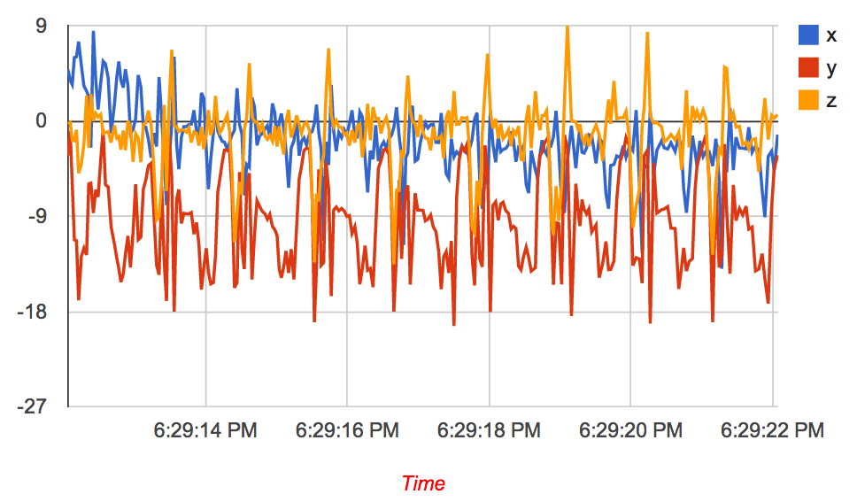
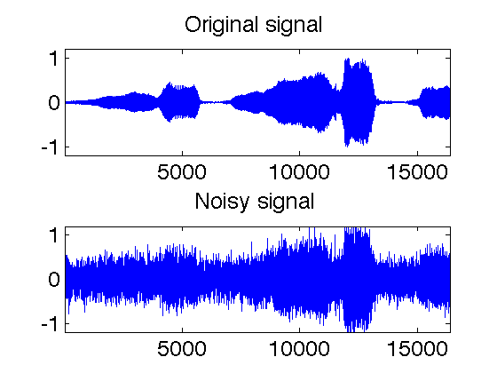

## Table of Contents
{: .no_toc .text-delta }

1. TOC
{:toc}
---

## Introduction to sensor data smoothing and filtering

Most sensor data is affected to some extent by **noise**, that is unexplained variations in the data that in many cases is uninterpretable, and in almost all cases is not of interest to us. Data analysis is often considerably simpler if this noise can be removed from the data. This process is referred to by various terms - data smoothing, filtering, cleaning, and so on. The underlying idea in all these methods is to remove the noise while retaining the important characteristics of the signal.

Noise removal techniques can be divided into two class. The first is time-domain approaches, which is the more intuitive way of approaching the problem. The second is frequency-domain approaches, which removes noise that is periodic in nature. Our goal is not to provide a detailed mathematical exposition of these techniques but to keep it practical. You can tackle most issues with noise in sensor data analysis by understanding the general idea underlying these techniques, and by knowing which denoising technique to apply and when. Before we launch into these three classes, however, we give you a brief introduction into the difference being time and frequency domain information in signals, and noise in sensor signals.

## Information and Noise in Signals

One very important part of any sensor data processing task is understanding how information is contained in the signals you are working with, and what types of noise can corrupt the signal and make it difficult to extract the information. 

There are two ways that are common for information to be represented in naturally occurring signals. We will call these: information represented in the time domain, and information represented in the frequency domain. Information represented in the time domain describes when something occurs and what the amplitude of the occurrence is. For example, you may be interested in the temperature of this room, the orientation of your phone, your location and driving trajectory, and so on. All of these contain information in the time domain.

In contrast, information represented in the frequency domain is more indirect. Many things in our universe show periodic motion. For example, accelerometer readings when you walk show periodic motion; a wine glass struck with a fingernail will vibrate, producing a ringing sound; your heart beats in a quasi-periodic manner; the pendulum of a grandfather clock swings back and forth, and so forth. By measuring the frequency, phase, and amplitude of this periodic motion, information can often be obtained about the system producing the motion. Suppose we sample the accelerometer on your phone. A single sample, in itself, contains no information about the periodic motion, and therefore no information about the walking activity. The information is contained in the frequency with which patterns corresponding to steps occur in the signal.

Noise is anything that corrupts the signal and makes it difficult to extract the information of interest. We deal with noisy signals all the time, often without our knowledge. For example, when we use a thermometer to check body temperature, it is common to take two or three readings to verify that the first one did not have noise. 

There are many different types of noise --- noise may appear are sudden spikes in the signal, as  random perturbations, as periodic variations, and so on. The underlying physical phenomena causing noise can range from quantum noise or electronic and mechanical noise in the sensor, to a variety of external factors that depend on sensor placement, external vibrations and electronic interference and so on.

Now that you understand the difference between information and noise, let us turn to what causes noise in sensor data. We will start by showing you different examples of noisy signals and what are some common sources of noise in these signals.

## Noise in Accelerometer Data

Figure 1 shows the typical accelerations along the three axes (x, y, and z) while walking. You can see that there is clearly some periodic pattern in this data, but it also seems really noisy making it hard to analyze the data to extract useful information such as number of steps. The noise in the accelerometer signal can be categorized into two types.

_Figure 1: Typical pattern of x, y, and z accelerations while walking with smartphone in pocket._

**Intrinsic sensor noise**: Some of the sources of noise in an accelerometer is due to the electronic noise from the circuitry that is converting the motion into a voltage signal and the mechanical noise from the sensor itself. There are several sources of electronic noise, referred to as Johnson noise, shot noise, flicker noise, and several others.  The mechanical noise of the sensor comes from thermo-mechanical noise, which arises due to the fact that an accelerometer has tiny moving parts, and these are susceptible to mechanical noise due to molecular agitation. Normally, you don’t have to worry about the intrinsic sensor noise because the sensor manufacturer would have carefully calibrated the sensor and the hardware filters to deal with them. But sometimes they do manifest in the signal. 

**External vibration noise**: Another common source of noise is external vibration noise, which is noise from the movements external to the sensor and therefore affects the readings. For example, consider the case that you want to detect whether a phone is being carried by a person or not. An intuitive algorithm to determine this would be to check if the accelerometer reading is changing. If the accelerometer reading is continuously changing, that would imply that the phone is being carried, whereas if the reading is not changing, then it is stationary. 

If you implement this algorithm, you will find that it does not work as expected. The reason is that even though you think that the phone is stationary when placed on say, a table, there are continuous external vibrations induced by the earth’s movement, nearby vehicles, the HVAC system, people’s movement, and many others. These tiny movements manifest as small changes in the accelerometer reading which can be misinterpreted by your algorithm as a person carrying a phone.

As another example, take the case of the algorithm that detects how you are holding the phone and changes the screen orientation accordingly. This algorithm can use the accelerometer reading to measure tilt (more on this in a later lecture), but we do not want this measure to be influenced by the tremors of your hand. Even though you don’t realize it, there are continuous small tremors in our hand that will be picked up by an accelerometer. If you do not believe me, try holding a laser pointer in one hand and point it at a wall several meters away to see how steady your hand is. The vibrations of your hand make the accelerometer outputs appear “jittery”.  These jitters need to be smoothed before applying an algorithm to determine screen orientation.

## Noise in Electrocardiogram (ECG) Data

This problem is by no means isolated to accelerometer signals. For example, if you looked at signal from an ECG sensor, you would see a lot of noise sources such as those shown in Figure 2. 

_Figure 2: Typical ECG signal with different interference sources_

The figure shows four sources of noise in the ECG signal. One visible problem is power line interference i.e. the 50Hz power line signal causes electromagnetic interference which is recorded by the ECG device. This issue is particularly problematic for low frequency signals like ECG. Many other sources of ECG noise are present as well including those caused by breathing, muscle contractions, body movement, and so on. 

## Noise in Image Data

Images are often noisy, and these sources of noise need to be filtered out before meaningful information can be extracted from the data. Here are two examples of noisy images, and how they look after they are cleaned. In the first example (boat), one could argue that the boat is at least visible in the noisy signal, but in the second example (eye), the noisy data makes it very hard to even identify the fact that it is an image of the eye. Thus, noise can severely impact the visual quality of the image to the point where it may be even hard for the human eye to identify the object(s) present in the image.

_Figure 3: Noise in images. (left) salt-and-pepper noise, and (right) fixed pattern noise in camera_

The reasons for image noise are many as well --- often, noise is caused by the camera, especially in poor illumination conditions, high temperature or just electronic noise in the circuit. 

## Noise in Audio Signals 

Audio data recorded by a microphone can also be highly susceptible to noise. The noise could be due to ambient sound, for example, you are speaking in a party where many other people are simultaneously talking. Or it could be due to a loud noise nearby such as talking near a construction site. Of course, the hardware and circuit could add to the noise as well. Below is an example that shows how much noise can distort an audio signal.

_Figure 4: Noisy audio signal_

So, how do we deal with noise? Turns out that this is a vast topic, and there are many methods that have been fine tuned to handle noise for different types of sensors. We will not be able to talk about all these methods, but we will try to understand the classes of methods, and the tradeoffs in using these types of filtering techniques.

## Noise in GPS Data

Other sensor information like GPS location is also susceptible to noise. GPS readings can be noisy due to a variety of reasons including clock error, tropospheric delays, multipath effects due to buildings, weather conditions, and so on. If you have used Google Maps or any other mapping service, you may be tempted to believe that GPS is fairly accurate, but the raw data coming from the GPS receiver often has noise that is being smoothed before it is displayed on screen. For example, the figure below shows what you would get if you blindly connected the GPS locations coming from your receiver while you are driving down a street. The green line shows the actual trajectory that should have been observed if the GPS readings were error-free.

_Figure 5: Noisy GPS readings while driving in red. Actual trajectory in green._

