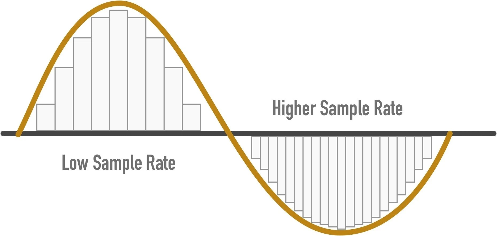

## Table of Contents
{: .no_toc .text-delta }

1. TOC
{:toc}
---

## Sampling Rate and Nyquist Frequency

Signals in the real world are continuous but for a computer to process the signals, they need to be sampled at a particular rate. For example, the accelerometer on your Fitbit may be sampling at 50Hz i.e. every 0.2 seconds in-order to detect steps. In the figure below, the signal is shown sampled at two different rates to illustrate sampling patterns.

_A continuous signal sampled at low sample rate (left) and high sample rate (right)_

**How many samples are necessary to ensure we are preserving the information contained in the signal?**  If the signal contains high frequency components, we will need to sample at a higher rate to avoid losing information that is in the signal.  In general, to preserve the full information in the signal, it is necessary to sample at twice the maximum frequency of the signal. This is known as the Nyquist rate, which comes from a surprising (but intuitive) result in signal processing that states that a signal can be exactly reproduced if it is sampled at a frequency F, where F is greater than twice the maximum frequency in the signal. For example, imagine we have an ECG signal composed of frequencies between 0 and 200 Hz. To properly digitize this signal, we must sample at  2∗200Hz. So, F needs to be 400Hz.

**What happens if we sample the signal at a frequency that is lower that the Nyquist rate?** When the signal is converted back into a continuous time signal, it will exhibit a phenomenon called aliasing.  Aliasing is the presence of unwanted components in the reconstructed signal.  These components were not present when the original signal was sampled.  In addition, some of the frequencies in the original signal may be lost in the reconstructed signal.  Aliasing occurs because signal frequencies can overlap if the sampling frequency is too low.  Frequencies "fold" around half the sampling frequency - which is why this frequency is often referred to as the folding frequency. This is shown in the below figure.

**What are the implications of the Nyquist theorem on filtering?** The main implication is that we cannot filter signals that are above the sampling rate. For example, if your data is sampled at 400Hz, then the Nyquist frequency is 200Hz, hence we cannot use a filtering technique to filter out frequencies that are higher than this.

_A series of waveforms showing a 7 kHz and 13 kHz tone sampled in a 10 kHz system with the resulting “alias tones” that are generated and output._

To learn more about the Nyquist rate and Aliasing, see [Jack Shaedler's excellent interactive site](https://jackschaedler.github.io/circles-sines-signals/sampling.html).
