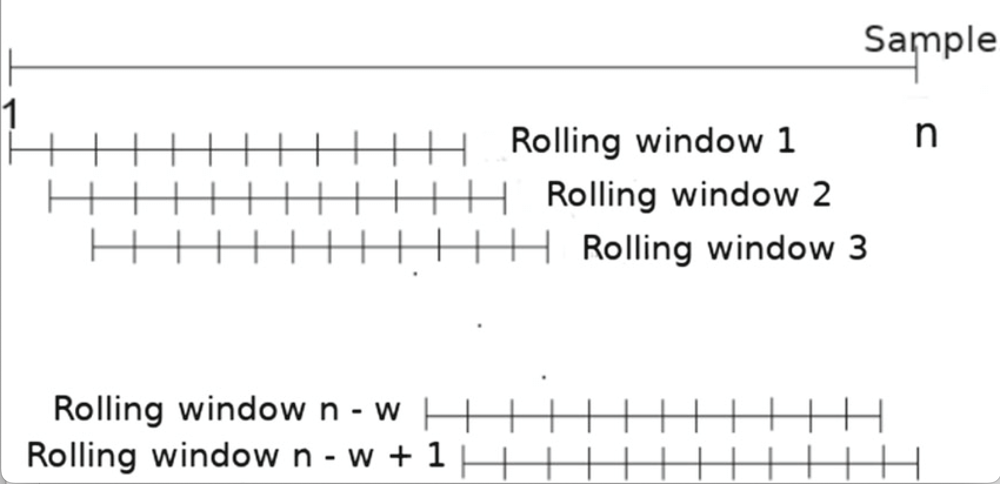
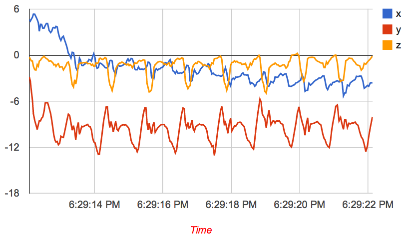

## Table of Contents
{: .no_toc .text-delta }

1. TOC
{:toc}
---

## Time-series Smoothing and Filtering

We start our discussion of smoothing methods with the simplest method, moving average smoothing and proceed to a variant of this method referred to as exponential weighted smoothing. The fact that they are simple doesn’t mean that they are not useful - in spite of their simplicity, these methods are surprisingly effective in practice, and therefore very widely used.

Regardless of the specific smoothing method, they are all applied over rolling or sliding windows as shown below. In other words, a window of data is picked up, then it is smoothed using one of several methods (e.g. moving average), and then the smoothed output sequence is generated. 

### Understanding Rolling or Sliding Windows

**Concept**: A rolling or sliding window is a subset of data points in a series that "slides" across the dataset. The idea is to divide the dataset into many overlapping subsets, perform a computation on each subset, and then move the window by a fixed amount to the next position. Here is a visualization of this procedure.


For instance, if we have a dataset:

```
data = [1, 2, 3, 4, 5, 6, 7, 8, 9, 10]
```

A rolling window of size 3 would generate the following subsets:

```
[1, 2, 3], [2, 3, 4], [3, 4, 5], ..., [8, 9, 10]
```

For each subset, an operation (like averaging for a moving average filter) is performed. The result of this operation on each subset generates a new series.

**Why Rolling Windows?**: In time series analysis, data often contains fluctuations or noise that might obscure patterns. Analyzing the data in smaller chunks, or windows, allows us to mitigate the effects of these fluctuations and to discern underlying patterns or trends. Imagine a spotlight moving across a stage, illuminating only a small portion of the stage at a time. As the spotlight moves, you see a changing scene within its confines. Similarly, a rolling window "illuminates" a subset of the data, and as it slides, the subset changes, offering a "localized" view of the data at each position.

**Padding and Edge Effects**: One detail to note when using rolling windows is the "edge effect". At the beginning and end of our data series, there aren't enough data points to form a complete window. For example, with our dataset above, the first data point (1) does not have two preceding data points for a window of size 3.

One solution to this is "padding", where we artificially extend our dataset at the beginning and end. There are different methods to do this:
1. **Zero Padding**: Add zeros to the start or end of the dataset.
2. **Reflective Padding**: Reflect the data points at the edge. For our data, this might mean adding a "0" before the "1" and an "11" after the "10".
3. **Constant Padding**: Use the edge values as padding. For our data, this would mean adding another "1" before the "1" and another "10" after the "10".

The choice of padding method depends on the nature of the data and the specific application. However, padding can introduce inaccuracies, so it's crucial to be aware of the potential implications.

### Moving Average Smoothing

One common technique to smooth signals is to perform a moving average. Lets try use an example to illustrate this approach. Lets say we have a noisy accelerometer signal, and let us try to apply a moving average smoothing to this signal. We are going to replace each sample by the average of the current sample, the sample before it, and the sample after it. 

More precisely, let us represent the input accelerometer signal as follows:

x =  x<sub>1</sub>, x<sub>2</sub>, x<sub>3</sub>, … x<sub>n</sub> where the index is the sample number.

The output of the moving average filter is:

  _s<sub>1</sub>_ = (x<sub>1</sub> + x<sub>2</sub> + x<sub>3</sub>)/3

 _s<sub>2</sub>_ = (x<sub>2</sub> + x<sub>3</sub> + x<sub>4</sub>)/3

 _s<sub>3</sub>_ = (x<sub>3</sub> + x<sub>4</sub> + x<sub>5</sub>)/3

  …

 _s<sub>n-2</sub>_ = (x<sub>n-2</sub> + x<sub>n-1</sub> + x<sub>n</sub>)/3

In the example above, we averaged three input values together, but we could have averaged more nearby points to smooth even more aggressively. As you increase the smoothing window, the signal will look cleaner and more visually pleasing, but beware of using too large a window since you will smooth out the important characteristics of the signal (for example, steps if you want to do step detection).

Note that in the above example, we have `n` input samples but `n-2` output samples. This is because there are only `n-2` valid windows of size three in the data. In some cases, though we might want as many output samples as input samples for convenience of processing the data -- you can specify this with appropriate parameters in the python function as described at the end of this page.

### Exponential Moving Average Smoothing

Exponential Moving Average (EMA) is another common technique to smooth signals, often used because it gives more weight to recent observations while still considering older observations but with exponentially decreasing weights. This property can be especially useful if you believe that recent observations carry more information about the future than older ones.

Let's illustrate this approach with an example similar to the moving average technique. For a window size of 3, we can define weights such that the current sample gets the highest weight, the previous sample gets a lesser weight, and the sample before that gets even lesser weight. 

<!---

--->

More precisely, let us represent the input accelerometer signal as:

x =  x<sub>1</sub>, x<sub>2</sub>, x<sub>3</sub>, … x<sub>n</sub> where the index is the sample number.

Now, consider weights a, b, and c, with a > b > c and a + b + c = 1. The output of the EMA filter is:

  _s<sub>1</sub>_ = a * x<sub>1</sub> + b * x<sub>2</sub> + c * x<sub>3</sub>

 _s<sub>2</sub>_ = a * x<sub>2</sub> + b * x<sub>3</sub> + c * x<sub>4</sub>

 _s<sub>3</sub>_ = a * x<sub>3</sub> + b * x<sub>4</sub> + c * x<sub>5</sub>

  …

 _s<sub>n-2</sub>_ = a * x<sub>n-2</sub> + b * x<sub>n-1</sub> + c * x<sub>n</sub>

For instance, if you choose a = 0.5, b = 0.3, and c = 0.2, it ensures that the current sample has more influence than the previous ones. 

However, this simple illustration does not fully represent the true nature of EMA. In a generalized form, the weight given to each observation decreases exponentially, ensuring that every observation in the dataset has some amount of influence. This is mathematically expressed using a decay factor, often represented as α (alpha). The equation is:

_s_ = α * x + (1 - α) * _s_<sub>previous</sub>

Where _s_<sub>previous</sub> is the previous smoothed value and _s_ is the current smoothed value. The parameter α (alpha) is between 0 and 1, where a higher value gives more weight to recent observations. In libraries like pandas, `span` is often used instead of α, which is an alternative way of defining how much weight the observations should have.

Like with the simple moving average, one must take care when choosing the smoothing factor to ensure that important characteristics of the data are not lost. Again, depending on the implementation or use-case, you might want as many output samples as input samples, which can be achieved with appropriate parameters in the Python function, as shown in the example above.

The effect of exponential smoothing of an accelerometer signal obtained during walking is shown in Figure 1. You can now start to see the distinct steps much more cleanly, and you can even count them quite easily by eye. 

<p float="left">
  
  
</p>
_Figure 1: (left) accelerometer signal during walking without smoothing (right) after exponentially weighted smoothing with smoothing = 6_ (i.e. _α = ⅙).

### Median Filtering

When the noise appears like sudden spikes in the data (also referred to as salt-and-pepper noise) or if the data has outliers (i.e. spurious readings that are very large or very small compared to the data) or if the data has sharp edges, then the moving average and exponential smoothing methods are not the best methods. An example is shown below, where the noise pattern comprises sharp spikes in the data. Exponential smoothing will remove noise but not very well.


_Figure 2: Exponential smoothing vs Median filtering. Median filtering is better for removing spikes in the signal (salt-and-pepper noise) compared to exponential smoothing._

One solution to this issue is to use median filtering. The median filter operates over sliding windows as with moving average and exponential smoothing, but computes the median over each window rather than the average. If the input accelerometer signal is: x =  x<sub>1</sub>, x<sub>2</sub>, x<sub>3</sub>, … x<sub>n</sub> , the output of the median filter is:

 _s<sub>1</sub>_ = median(x<sub>1</sub> , x<sub>2</sub> , x<sub>3</sub>)

 _s<sub>2</sub>_ = median(x<sub>2</sub> , x<sub>3</sub> , x<sub>4</sub>)

 _s<sub>3</sub>_ = median(x<sub>3</sub> , x<sub>4</sub> , x<sub>5</sub>)

  …

 _s<sub>n-2</sub>_ = median(x<sub>n-2</sub> , x<sub>n-1</sub> , x<sub>n</sub>)
 
### Comparison between the three methods

When dealing with time-series data from sensors, it's essential to choose the appropriate filtering technique that aligns with the characteristics of the noise and the desired features you wish to preserve in the data. Below are some of the pros and cons of each of the above methods.

1. **Moving Average Smoothing**
    - **Advantages**:
        - Simple to implement and understand.
        - Effective at reducing random noise.
        - Provides a smoothed curve without much lag, depending on the window size.
    - **Disadvantages**:
        - Peaks can be smoothed out, especially with a larger window size.
        - Sensitive to outliers, as it treats every point with equal weight.
        - Can introduce a phase lag depending on the size of the window.
    
2. **Exponential Moving Average (EMA)**
    - **Advantages**:
        - Weights recent data more heavily, preserving more recent trends.
        - Can be tuned (via the alpha parameter) to adjust the level of smoothing versus the lag.
        - Requires less memory than the moving average as it doesn’t require storing previous observations.
    - **Disadvantages**:
        - Still can be influenced by significant outliers, although to a lesser extent than the moving average.
        - The choice of alpha can be critical and may require iterative experimentation.

3. **Median Filtering**
    - **Advantages**:
        - Excellent at preserving edges (sudden changes in data).
        - Highly effective against salt-and-pepper noise (random high and low spikes).
        - Not influenced by outliers, making it resistant to skewed data.
    - **Disadvantages**:
        - Might not smooth data as uniformly as the other methods.
        - Requires sorting, which might not be efficient for large window sizes.

### Python Code Examples using Pandas

To filter sensor data in Python, the Pandas library is a powerful tool. Below are code snippets for each of the three filtering techniques using Pandas:

```python
import pandas as pd
import numpy as np

# Create sample data
data = {'Sensor': np.random.randn(100)}
df = pd.DataFrame(data)

# Moving Average Smoothing
df['Moving_Avg'] = df['Sensor'].rolling(window=3).mean()

# Exponential Moving Average
df['Exp_MA'] = df['Sensor'].ewm(span=5, adjust=False).mean()

# Median Filtering
df['Median_Filter'] = df['Sensor'].rolling(window=3).median()
```

**Parameters Explanation**:
- For `rolling()`: 
    - `window`: Defines the number of observations to consider. It can be adjusted depending on the desired level of smoothing. The result size depends on the method parameter:
      - `valid` - Returns only those convolution results that are computed without padding. This shrinks the output size.
      - `full` - Uses padding, resulting in an output size as large as the input. Edge windows are calculated using the available values, and the rest are filled using padding.
      - Default is `None` which means the same size as input.
- For `ewm()`: 
    - `span`: Defines the span of the Exponential Moving Average i.e. how many samples to consider.

Below is an example of rolling window. 


### Alternate Methods using Numpy

You can also use Numpy's `convolve` function for moving average:

```python
window = 3
weights = np.repeat(1.0, window) / window
sma = np.convolve(df['Sensor'], weights, 'valid')
```

**Parameters Explanation for Numpy's `convolve`**:
- The third parameter to `convolve` specifies the mode:
    - `valid` - Returns only those convolution results that are computed without any padding. This shrinks the output size.
    - `full` - Uses padding, resulting in an output size larger than the input. Edge windows are calculated using the available values, and the rest are filled using padding.
    - `same` - Returns convolution of the same size as the input, achieved by using adequate padding.

Remember that each method has its strengths and weaknesses, and it's essential to understand the underlying noise characteristics and the features of interest in your data before choosing a filter. It's also a good practice to visualize the filtered data to ensure it aligns with your expectations.

Because they are so simple to implement and understand, time-domain smoothing is often the first methods tried when faced with a problem. These work well in practice when noise is in the time domain but many sensor signals have frequency domain noise, so it is important not to rely too much on time domain smoothing.

### Example Notebook: Time Domain Noise Removal [[html](notebooks/Chapter1-TimeDomainNoiseRemoval.html)] [[ipynb](notebooks/Chapter1-TimeDomainNoiseRemoval.ipynb)]
This annotated notebook shows a few examples of time-series signals and how different time-domain smoothing methods (moving average, exponentially weighted moving average, and median filtering) work on this data. 

