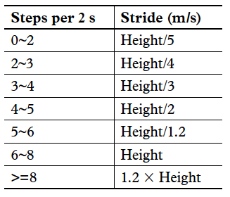
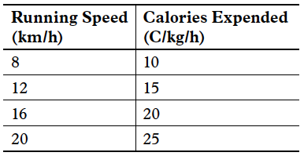

## Table of Contents
{: .no_toc .text-delta }

1. TOC
{:toc}
---

## Counting Calories

Determining the exact number of calories expended by an individual based on the number of steps that they have taken is an approximate science, and there is no accurate means of obtaining this measure. However, there are some useful heuristics that can be applied, and we are going to explore one of them. The basic idea is to figure out the running/walking speed of the individual (distance/time), and then use information about the weight to determine calories expended.

**Estimating Distance Covered**: After computing the steps parameter according to the algorithm above, we can use Equation 1 to get the distance parameter.

_Distance = number of steps × distance per step (1)_

Distance per step depends on the speed and the height of user. The step length would be longer if the user is taller or running at higher speed. We use the steps counted in every two seconds to judge the current stride length. Table 2 shows the experimental data used to judge the current stride.

_Table 2. Stride as a Function of Speed (steps per 2 s) and Height_

**Estimating Speed**: Speed = distance/time, so Equation 2 can be used to get the speed parameter, as steps per 2 s and stride have all been calculated according to the algorithm above.

_Speed = steps per 2 s × stride/2 s (2)_

**Estimating Calories**: Unfortunately, there is no accurate means for calculating the rate of expending calories. Some factors that determine it include body weight, intensity of workout, conditioning level, and metabolism. We can estimate it using a conventional approximation, however. Table 3 shows a typical relationship between calorie expenditure and running speed.

_Table 3. Calories Expended vs. Running Speed_

From Table 3, we can get (3).

_Calories (C/kg/h) = 1.25 × running speed (km/h) (3)_

The unit of the speed parameter used above is m/s; converting km/h to m/s gives Equation 4.

_Calories (C/kg/h) = 1.25 × speed (m/s) × 3600/1000 = 4.5 × speed (m/s) (4)_

The calories parameter would be updated every 2s with the distance and speed parameters. So, to account for a given athlete’s weight, we can convert Equation 4 to Equation 5 as indicated.

Weight (kg) is a user input, and one hour is equal to 1800 two second intervals.

_Calories (C/2 s) = 4.5 × speed × weight/1800 = speed × weight/400 (5)_

If the user takes a break in place after walking or running, there would be no change in steps and distance, speed should be zero, then the calories expended can use Equation 6 since the caloric expenditure is around 1 C/kg/hour while resting.

_Calories (C/2 s) = 1 × weight/1800 (6)_

Finally, we can add calories for all 2-second intervals together to get the total calories expended.

## References

[1] [Full-Featured Pedometer Design Realized with 3-Axis Digital Accelerometer](http://www.analog.com/static/imported-files/tech_articles/pedometer.pdf), Neil Zhao

[2] [Step Detection Algorithms for Accelerometers](http://nitarc.be/map/paper/AMBIT_ThuerVerwimp.pdf), Guillaume Thuer and Tim Verwimp

[3] [Calorie counting calculation](http://www.livestrong.com/article/80988-caloric-intake-body-mass/), Beth Spicer

[4] [A simple method for reliable footstep detection on embedded sensor platforms](http://ubicomp.cs.washington.edu/uwar/libby_peak_detection.pdf), Ryan Libby

[5] [A pedometer in the real world](http://www.aosabook.org/en/500L/a-pedometer-in-the-real-world.html), Dessy Daskalov
