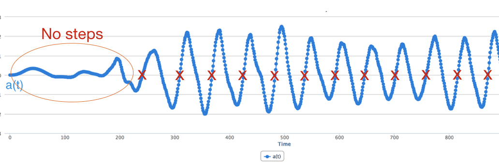
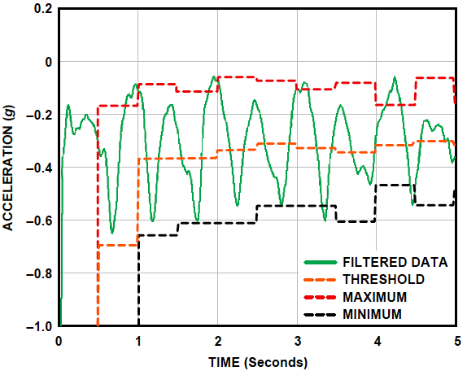

## Step Detection Algorithm

There are many different ways that we can design a step detection algorithm. We outline one such method in this section. The key insight in our method is to convert the 3-axis signal into a one axis magnitude signal, and then extract steps from this signal.

_Figure 5: Step Detection Algorithm_

**Step 1: Extract signal magnitude**: In the previously described algorithm, we selected the axis along which maximum acceleration occurred and focused on that one. Here, we are just going to take the magnitude of the entire acceleration vector i.e. 

>>>>>  gd2md-html alert: equation: use MathJax/LaTeX if your publishing platform supports it.  (<a href="#">Back to top</a>)(<a href="#gdcalert7">Next alert</a>) >>>>> 

, where x, y, and z are the readings of the accelerometer along the three axes. 

_Figure 6: Example showing sources of noise in magnitude signal_

**Step 2: Filter the signal to remove noise**: The second step is to remove noise, and extract the specific signal corresponding to walking. Before we perform this step, we need to know what are the sources of noise. There are several sources of noise that we need to filter out (shown in Figure 6):

* **Jumpy peaks**: Since the phone is often carried in a pocket/purse, it can jiggle a little with each step. Also, some users have a bounce in their step, so even though they are taking a single step, the phone can bounce multiple times within this step. 
* **Short peaks**: Small peaks can occur when a user is using a phone (e.g. making a call or using an app).
* **Slow peaks**: Slow peaks can occur when the phone is moved or due to movements of the leg while sitting (if the phone is in the pant pocket)

To remove these sources of noise, we are going to use frequency-domain noise removal. Notice that we need to remove high frequency variations like jumpy peaks and low frequency variations like slow peaks. A simple solution is to use a filter that keeps only frequencies relating to walking and removes the rest. For example, we know that typical walking pace may be under three steps a second (3 Hz) and over half step a second (0.5Hz), so perhaps we remove all frequencies above 5 Hz and below 0.5 Hz (just to give some margin for error). Note that this method would not be able to detect running or bicycling, which may have higher pace. 

Even after we remove low and high frequency peaks, we may be left with some short peaks. A simple way to deal with this is to look only for large peaks and ignore small peaks.

_Figure 7: Zero crossings (left) and peaks (right) of the filtered magnitude signal_

**Step 3: Detecting Steps.** Once you have the smoothed data, let us consider how to detect the step. We could do what was suggested earlier, which is to look for large peaks and use that to detect steps. Another approach is to take the derivative (slope) of the smoothed acceleration signal. The derivative changes from negative to positive (or positive to negative) exactly when a step occurs, so you can just count the number of times the derivative changed from negative to positive to detect the number of steps that occurred.  Another possibility is to subtract the mean for each window and look at  zero crossings i.e. times when the signal crosses from the negative to positive in the upward direction (this can be tricky, however, since the signal baseline can change over time as shown below). 

_Figure 8: Filtered data on the most active axis._

**Dynamic Threshold-based Step Detection**: Another algorithm for step detection is a dynamic threshold detection algorithm. The first step in this algorithm is keeping track of the axis (x, y, or z) along which the maximum acceleration occurs. We can ignore all other axes and just focus on this specific one for our algorithm. Given this axis, we keep track of the min and max acceleration levels over a window of samples. In other words, we continuously measure the maximum and minimum values of the 3-axis acceleration every 50 samples. The average value, (_Max _+ _Min_)/2, is called the _dynamic threshold level_. For the following 50 samples, this threshold level is used to decide whether steps have been taken. As it is updated every 50 samples, the threshold is _dynamic_. The Max, Min, and (dynamic) Threshold for the z-axis is shown in Figure 4.

Given the dynamic detection threshold, the step detection algorithm can work by looking for crossings of the threshold in the downward (or upward) direction. For example, if you look at Figure 4, you will see that each step involves a crossing of the threshold (orange line) in the downward direction with a substantial change in acceleration in the negative direction. In other words:

_A step is defined as happening if there is a negative slope of the acceleration plot (sample_new &lt; sample_old) when the acceleration curve crosses below the dynamic threshold._

These are just two possible algorithms for detecting steps. It won’t be perfect, and better algorithms are possible. I encourage you to try other schemes, and refine the step detection algorithm to improve its accuracy. If you find a better approach, please let me know!
