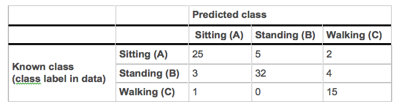
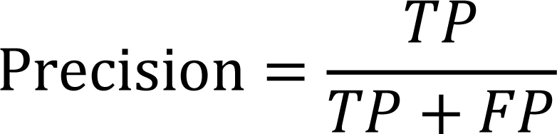
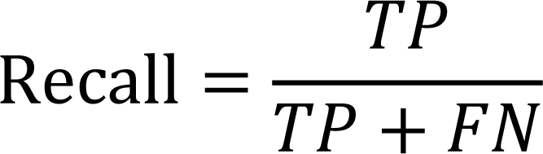
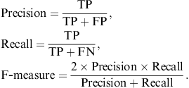

## Table of Contents
{: .no_toc .text-delta }

1. TOC
{:toc}
---

## Chapter 4: Evaluating Classifier Performance

We have a data set of examples of activities (sitting, standing, etc) where we know which activity was being performed. How do we go about measuring the performance of your decision tree classifier?

To do this we use a test set consisting of examples where we know what activity was being performed but the classifier doesn’t! We train the classifier on the training set, apply it to the test set, and then measure performance by comparing the predicted labels with the true labels (which were not available to the classifier). This is the general idea, but there are several ways to go about dividing the data into training and test sets, as well as evaluating performance of the classifier on these sets. We tackle these two questions in this chapter.

## Cross Validation

Cross validation is an evaluation method to identify how well the classifier will perform for data it has not already seen. One way is to not use the entire data set when training a learner. Some of the data is removed before training begins. Then when training is done, the data that was removed can be used to test the performance of the learned model on ``new'' data. This is the basic idea for a whole class of model evaluation methods called _cross validation_.

### Holdout method

The **holdout method** is the simplest kind of cross validation. The data set is separated into two sets, called the training set and the testing set. A common rule of thumb is to use 70\% of the dataset for training and 30\% for testing. Dividing the data into training and test subsets is usually done randomly, in order to guarantee that there is no systematic error in the process.

The classifier is learnt using the training set only. Then the classifier is asked to predict the output values for the data in the testing set (it has never seen these output values before). The errors it makes are accumulated as before to give the mean absolute test set error, which is used to evaluate the model.  

However, its evaluation may depend heavily on which data points end up in the training set and which end up in the test set, and thus the evaluation may be significantly different depending on how the division is made.

### N-fold cross validation

**N-fold cross validation** is one way to improve over the holdout method. The data set is divided into _n_ subsets, and the holdout method is repeated _n_ times. Each time, one of the _n_ subsets is used as the test set and the other _n-1_ subsets are put together to form a training set. Then the average error across all _n_ trials is computed. The advantage of this method is that it matters less how the data gets divided. Every data point gets to be in a test set exactly once, and gets to be in a training set _n-1_ times. This is more robust to issues of how you end up dividing data into training and test sets. The disadvantage of this method is that the training algorithm has to be rerun from scratch _n _times, which means it takes _n_ times as much computation to make an evaluation. However, this is not an issue for small datasets such as the one you will be working with.

### Is all of this necessary?

This sounds like a lot of work, so you might wonder if it is necessary to divide your data this way. But it is absolutely vital to measure the performance of a classifier on an independent test set. Every classifier looks for patterns in the training data, i.e. correlations between the features and the class. Some of the patterns discovered may be spurious, i.e. they are valid in the training data due to randomness in how the training data was selected, but they are not valid, or not as strong, in the whole dataset. A classifier that relies on these spurious patterns will have higher accuracy on the training examples than it will on the rest of the data. Only accuracy measured on an independent test set is a fair estimate of accuracy on the the entire data. The phenomenon of relying on patterns that are strong only in the training data is called overfitting. 

## Performance measures

Having divided into training and test sets, the next question is how to evaluate the performance of the classifier. 

### The Confusion matrix

When evaluating a classifier, there are different ways of measuring its performance. One commonly used method of evaluating whether the classifier correctly separated classes is to use a confusion matrix. Consider e.g. a three class problem with the classes Sitting, Standing, and Walking (let us refer to them as A, B, and C for ease of notation. A decision tree classifier may result in the following confusion matrix when tested on independent data.

 

The confusion matrix shows how the predictions are made by the model. The rows correspond to the known class of the data, i.e. the labels in the data. The columns correspond to the predictions made by the model. The value of each of element in the matrix is the number of predictions made with the class corresponding to the column for examples with the correct value as represented by the row. Thus, the diagonal elements show the number of correct classifications made for each class, and the off-diagonal elements show the errors made.

 

In the calculations below, we will also use this abstract confusion matrix for notation.

#### Accuracy

Accuracy is the overall correctness of the model and is calculated as the sum of correct classifications divided by the total number of classifications.

#### Precision

Precision is a measure of the accuracy provided that a specific class has been predicted. It is defined by:

 

where tp and fp are the numbers of true positive and false positive predictions for the considered class. In the confusion matrix above, the precision for the class A would be calculated as:

PrecisionA = tpA/(tpA+eBA+eCA) = 25/(25+3+1) ≈ 0.86

The number is reported by RDS as a value between 0 and 1.

#### Recall

Recall is a measure of the ability of a prediction model to select instances of a certain class from a data set. It is commonly also called sensitivity, and corresponds to the true positive rate. It is defined by the formula:

 

where tp and fn are the numbers of true positive and false negative predictions for the considered class. tp + fn is the total number of test examples of the considered class. For class A in the matrix above, the recall would be:

RecallA = tpA/(tpA+eAB+eAC) = 25/(25+5+2) ≈ 0.78

#### F-measure

Rather than have two measures (precision, recall), it is often preferred to combine both into a single number referred to as the F-measure. This measure can be interpreted as a weighted average of the precision and recall, where the measure reaches its best value at 1 and worst score at 0.

To recap - there are three commonly used performance measures for classifier performance: precision, recall and f-measure. The equations are shown below - all numbers can be obtained from a confusion matrix for the classifier.

 

