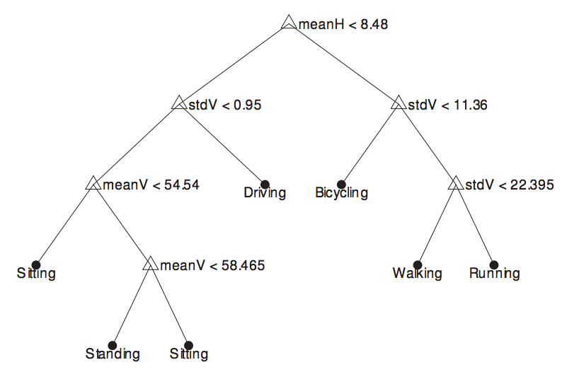

## Human Activity Recognition
{: .no_toc }

## Table of Contents
{: .no_toc .text-delta }

1. TOC
{:toc}
---

### Decision tree classifier

Once we extract different features from the data, it's time to build our classifier. At a high level, the goal of a classifier is to identify which of the above features that you obtained from your raw data is most useful in distinguishing between the different activities that you want to classify. There are many different classifiers, and an exhaustive summary would take too much time. But let me try to introduce one such classifier to provide an intuition for how such a method would work.

**What is a decision tree?** One of the most commonly used classifiers is a decision tree. The idea is simple and best explained with an example. Suppose you had the following six features - means along each of the x, y, z axes, and standard deviations along each of these axes. Given these features, you want to distinguish between standing, sitting, walking, running, biking, and driving. The key question is which of these features is most useful to distinguish between these activities. 

**How does a decision tree work?** The idea behind a decision tree is to view this problem in a hierarchical manner. First, let us assume that we already constructed a decision tree (see figure above), and just try to understand how to use it, and what its telling us. In the above figure, the root node makes a decision on whether meanX &lt; 8.48 (this number is not important for now, focus on the concept). If true, then the decision is to take the right branch, and if false, take the left branch. Say we took the right branch - then we look at another decision, say checking if stddevX &lt; 11.36. Similarly, this decision tree proceeds by checking one feature after another until we finally get to the leaf node that tells us what our current state is. So, the process of using a decision tree to classify the current activity seems intuitive - its just a sequence of if-then-else statements with each statement checking the values of one or more parameters. But what does each of these branches really mean? What separates the left branch and the right branch?


	
_Figure 3: Example of a decision tree_

**Decision tree with an example.** Let us look at an example of a decision tree and try to interpret its meaning. The root node separates {sitting, standing, driving} on the left branch from {biking, walking, running} on the right branch. Clearly, this node is identifying some feature that separates between more sedentary activities from the more active ones. This makes sense - if we had to think of an algorithm, we would perhaps do the same thing. Let's now look at the decision nodes at the next level down starting with the left branch. This node separates driving from other sedentary activities (sitting, standing) by looking at the standard deviation of the Z axis. This seems to make sense as well - driving will cause lots of vibrations due to the car and the road, whereas we are unlikely to see these vibrations when you are sitting on a chair or standing (unless there’s an earthquake!). The corresponding decision node on the right branch seems to be doing something similar - it uses standard deviation on the vertical axis to distinguish between biking, and other physical activities such as running and walking. The intuition is that biking on the road is likely to have small vibrations because of the road whereas running or walking has large variations due to acceleration changes for each step (as you observed in the pedometer case study). The remaining decision nodes in the left branch no longer use the standard deviation, and only use the mean to separate sitting and standing. This is easiest to understand from Figure 1 where we saw the raw accelerometer signal for sitting and standing. Both are flat, so there’s little to be gained from looking at standard deviation, but they have different averages, so this is the most useful feature for separating the classes. On the right branch, walking vs running uses the difference in standard deviations between these two - intuition would suggest that running has more vibrations than walking. In summary, a decision tree works by identifying which features best separate the categories, and builds it as a tree structure. 

Perhaps a simpler approach to understand how a decision tree works is to view it as a series of questions. Consider a game where your friend has chosen an activity class, and you need to guess it. You are allowed a sequence of questions, each of which could be about some characteristic about the classes. What is the minimal number of questions you might ask? In this example, the first question you might as is: Is the user in a sedentary or active state? If the answer is “active”, you might ask further questions to refine the state. The  decision tree can be viewed as learning the best sequence of questions given the data and its characteristics.

### Decision Tree Construction using Entropy

We now understand how a decision tree works but how do we build the decision tree in the first place. The primary challenge in the construction of a decision tree is deciding on which attributes to split and in what order. One of the popular algorithms to handle this is C4.5, which uses entropy as a metric to determine the best split.

#### Entropy

Entropy, derived from information theory, measures the level of uncertainty or randomness. In the context of decision trees, it quantifies the randomness or impurity in a label set. The 
 for entropy for a binary classification (for simplicity) is given as:

$ \text{Entropy}(S) = -p_+ \log_2(p_+) - p_- \log_2(p_-) $

Where:
- $ p_+ $ is the proportion of positive examples in $ S $
- $ p_- $ is the proportion of negative examples in $ S $

If the sample is completely homogeneous (either entirely positive or entirely negative), the entropy is 0. If the sample is an equally divided mixture of positive and negative examples, the entropy is 1 (maximum).

Absolutely! The concept of entropy can be extended naturally to multiclass classification scenarios. 

### Multiclass Entropy

For binary classification, the entropy formula looks at the proportions of positive and negative examples. When you have multiple classes, the formula is simply expanded to account for all these classes.

Given $ C $ as the set of all classes, for a multiclass problem, entropy $ S $ is defined as:

$ \text{Entropy}(S) = - \sum_{c \in C} p_c \log_2(p_c) $

Where:
- $ p_c $ is the proportion of samples belonging to class $ c $ in $ S $.

For a sample that is completely homogeneous with respect to a class (i.e., all members of the sample belong to that class), the entropy is 0, just like the binary case. The maximum value of entropy depends on the number of classes. For instance, if there are 3 classes, and each class is equally represented in the sample, the entropy is $- \frac{1}{3} \log_2(\frac{1}{3}) \times 3 = \log_2(3) \approx 1.58$. As you can see, the more classes, the higher the maximum entropy.

#### Information Gain

To determine which attribute should be selected as the decision node, we use a metric called Information Gain. It calculates the effectiveness of an attribute in classifying the training data. The attribute with the highest information gain is chosen as the decision node at a particular level.

The formula to compute Information Gain is:

$\text{Information Gain}(S, A) = \text{Entropy}(S)  - \sum_{v \in \text{Values}(A)} \frac{\|S_v\|}{\|S\|} \text{Entropy}(S_v) $

Where:
- $ S $ is the set of examples
- $ A $ is an attribute
- $ S_v $ is the subset of $ S $ for which attribute $ A $ has value $ v $

#### Building the Tree: C4.5 Algorithm

**Pseudocode:**

```
function BuildTree(samples, attributes)
    if all samples have the same label
        return a leaf node with that label
    if attributes is empty
        return a leaf node with the most common label of samples
    select the best attribute A using Information Gain
    create a tree T with A as the root
    for each value v of A
        add a branch to T for the test A = v
        let Sv be the subset of samples where A = v
        if Sv is empty
            add a leaf node with the most common label of samples
        else
            add BuildTree(Sv, attributes - {A}) to T
    return T
```

To summarize:

1. For each attribute, calculate the entropy before the split and the weighted entropy of each possible split, then compute the information gain.
2. Choose the attribute with the highest information gain for the split, creating a node.
3. Divide the dataset by the values of the chosen attribute, then recursively build subtrees in the same manner.
4. The recursion stops once all data belongs to a single class or no attributes remain.

This process allows for a decision tree that maximizes the reduction in randomness or impurity at each level, making it efficient in making predictions on unseen data.

Note: While understanding the construction is crucial, in practical scenarios, libraries like `scikit-learn` offer optimized implementations of the Decision Trees that abstract away these internal details, making it easier to apply to real-world problems.

## Example: Cardiac Risk Prediction

Suppose our dataset contains the following attributes:

1. **Age**: <40, 40-55, >55
2. **Smoker**: Yes, No
3. **Exercise**: Regularly, Rarely

Our target variable is:
**Risk**: High, Low

### Cardiac Risk Prediction Dataset:

| Age     | Smoker | Exercise   | Risk |
|---------|--------|------------|------|
| <40     | No     | Regularly  | Low  |
| <40     | No     | Rarely  | Low  |
| <40     | No     | Rarely     | Low  |
| <40     | Yes    | Regularly  | Low  |
| <40     | Yes    | Rarely     | High |
| 40-55   | No     | Regularly  | Low  |
| 40-55   | No     | Rarely     | High |
| 40-55   | Yes    | Regularly  | High |
| 40-55   | Yes    | Rarely     | High |
| >55     | No     | Regularly  | Low  |
| >55     | Yes    | Regularly  | High |
| >55     | Yes    | Rarely     | High |
| >55     | No     | Rarely     | High |

### Initial Entropy Calculation:

From the table:
- $p_{\text{Low}} = \frac{6}{13}$
- $ p_{\text{High}} = \frac{7}{13} $

Thus, the entropy for this set $ S $ is:
$ \text{Entropy}(S) = -\frac{6}{13} \log_2(\frac{6}{13}) - \frac{7}{13} \log_2(\frac{7}{13}) \approx 1$

### Information Gain Calculation:

#### For Age:

1. **Age <40:**
    - Total: 5
    - High Risk: 1
    - Low Risk: 4
    - $ \text{Entropy} = -\frac{1}{5} \log_2(\frac{1}{5}) - \frac{4}{5} \log_2(\frac{4}{5}) $ $ \approx 0.72 $

2. **Age 40-55:** 
    - Total: 4
    - High Risk: 3
    - Low Risk: 1
    - $ \text{Entropy} = -\frac{3}{4} \log_2(\frac{3}{4}) - \frac{1}{4} \log_2(\frac{1}{4}) \approx 0.81$
    
3. **Age >55:** 
    - Total: 4
    - High Risk: 3
    - Low Risk: 1
    - $ \text{Entropy} \approx 0.81 \text{(same as above)}$

Let us compute the weighted entropies and then the information gain for the Age attribute in the next step.

$ \text{Weighted Entropy for Age}  = \frac{5}{13} \times 0.72 + \frac{4}{13} \times 0.81 + \frac{4}{13} \times 0.81 \approx 0.78$

$ \text{Information Gain for Age} = \text{Initial Entropy} - \text{Weighted Entropy for Age} \approx 1 - 0.78 \approx 0.22$

#### For Smoker:

1. **Smoker = Yes:** 
    - Total: 6
    - High Risk: 5
    - Low Risk: 1
    - $ \text{Entropy} = -\frac{5}{6} \log_2(\frac{5}{6}) - \frac{1}{6} \log_2(\frac{1}{6}) \approx 0.65 $
    
2. **Smoker = No:** 
    - Total: 7
    - High Risk: 2
    - Low Risk: 5
    - $\text{Entropy} = -\frac{2}{7} \log_2(\frac{2}{7}) - \frac{5}{7} \log_2(\frac{5}{7}) \approx 0.86$

$ \text{Weighted Entropy for Smoker}  \approx \frac{6}{13} \times 0.65 + \frac{7}{13} \times 0.86 \approx 0.76 $

$ \text{Information Gain for Smoker} = \text{Initial Entropy} - \text{Weighted Entropy for Smoker} \approx 1 - 0.76 \approx 0.24  $

#### For Exercise:

1. **Exercise = Regularly:** 
    - Total: 6
    - High Risk: 2
    - Low Risk: 4
    - $ \text{Entropy} = -\frac{4}{6} \log_2(\frac{4}{6}) - \frac{2}{6} \log_2(\frac{2}{6}) = 0.92 $
    
2. **Exercise = Rarely:** 
    - Total: 7
    - High Risk: 5
    - Low Risk: 2
    - $ \text{Entropy} = -\frac{2}{7} \log_2(\frac{2}{7}) - \frac{5}{7} \log_2(\frac{5}{7}) = 0.86 $

$ \text{Weighted Entropy for Exercise} = \frac{6}{13} \times 0.92 + \frac{7}{13} \times 0.86 \approx 0.89 $

$ \text{Information Gain for Exercise} = \text{Initial Entropy} - \text{Weighted Entropy for Exercise} \approx 1 - 0.89 \approx 0.11 $

Given the information gains:

1. Age: 0.22
2. Smoker: 0.24
3. Exercise: 0.11

The attribute **Smoker** has the highest information gain and will be the root node. 

For the second-level decision, let's take the subset of data for one of the age groups, say "Age < 40", and repeat the computation of information gain for "Smoker" and "Exercise". We'll select the attribute with the highest information gain to split the data further. 

### Dataset subset for "Smoker = Yes":

| Age     | Smoker | Exercise   | Risk |
|---------|--------|------------|------|
| <40     | Yes    | Regularly  | Low  |
| <40     | Yes    | Rarely     | High |
| 40-55   | Yes    | Regularly  | High |
| 40-55   | Yes    | Rarely     | High |
| >55     | Yes    | Regularly  | High |
| >55     | Yes    | Rarely     | High |

From the subset, the probabilities are:

- $ p_{\text{High}} = \frac{5}{6} = 0.83 $
- $ p_{\text{Low}} = \frac{1}{6} = 0.17 $

Thus, the entropy for this subset $ S $ is: $-\frac{5}{6} \log_2(\frac{5}{6}) - \frac{1}{6} \log_2(\frac{1}{6}) $ $ \approx 0.65 $

#### For Age:

1. **Age <40:**
    - Total: 2
    - High Risk: 1
    - Low Risk: 1
    - $ \text{Entropy} = -\frac{1}{2} \log_2(\frac{1}{2}) - \frac{1}{2} \log_2(\frac{1}{2}) = 1 $

2. **Age 40-55:** 
    - Total: 2
    - High Risk: 2
    - Low Risk: 0
    - $ \text{Entropy} = 0$
    
3. **Age >55:** 
    - Total: 2
    - High Risk: 2
    - Low Risk: 0
    - $ \text{Entropy} = 0 $

$ \text{Weighted Entropy for Age}  = \frac{2}{6} \times 1 + \frac{2}{6} \times 0 + \frac{2}{6} \times 0 \approx 0.33$

$ \text{Information Gain for Age} = \text{Initial Entropy} - \text{Weighted Entropy for Age} \approx 0.65 - 0.33 \approx 0.32$

### Weighted Entropy and Information Gain for Exercise:

1. **Exercise = Regularly:** 
    - Total: 3
    - High Risk: 2
    - Low Risk: 1
    - $ \text{Entropy} = -\frac{2}{3} \log_2(\frac{2}{3}) - \frac{1}{3} \log_2(\frac{1}{3}) = 0.92 $
    
2. **Exercise = Rarely:** 
    - Total: 3
    - High Risk: 3
    - Low Risk: 0
    - $ \text{Entropy} = 0 $

$ \text{Weighted Entropy for Exercise} = \frac{3}{6} \times 0.92 + \frac{3}{6} \times 0 = 0.46 $
$ \text{Information Gain for Smoker} = 0.65 - 0.46 = 0.19 $

Given the information gains for the "Age > 55" group:

1. Age: 0.32
2. Exercise: 0.19

"Age" has the higher Information Gain for this group, so we will choose this as the next level node for Smoker=Yes.


### Dataset subset for "Smoker = No":

| Age     | Smoker | Exercise   | Risk |
|---------|--------|------------|------|
| <40     | No     | Regularly  | Low  |
| <40     | No     | Rarely  | Low  |
| <40     | No     | Rarely     | Low  |
| 40-55   | No     | Regularly  | Low  |
| 40-55   | No     | Rarely     | High |
| >55     | No     | Regularly  | Low  |
| >55     | No     | Rarely     | High |

From the subset, the probabilities are:

- $ p_{\text{High}} = \frac{2}{7} = 0.29 $
- $ p_{\text{Low}} = \frac{5}{7} = 0.71 $

Thus, the entropy for this subset $ S $ is: $-\frac{2}{7} \log_2(\frac{2}{7}) - \frac{5}{7} \log_2(\frac{5}{7}) $ $ \approx 0.86 $

#### For Age:

1. **Age <40:**
    - Total: 3
    - High Risk: 0
    - Low Risk: 3
    - $ \text{Entropy} = 0 $

2. **Age 40-55:** 
    - Total: 2
    - High Risk: 1
    - Low Risk: 1
    - $\text{Entropy} = 1$
    
3. **Age >55:** 
    - Total: 2
    - High Risk: 1
    - Low Risk: 1
    - $\text{Entropy} = 1$

$ \text{Weighted Entropy for Age}  = \frac{3}{7} \times 0 + \frac{2}{7} \times 1 + \frac{2}{7} \times 1 \approx 0.57$

$ \text{Information Gain for Age} = \text{Initial Entropy} - \text{Weighted Entropy for Age} \approx 0.86 - 0.57 \approx 0.29$

### Weighted Entropy and Information Gain for Exercise:

1. **Exercise = Regularly:** 
    - Total: 3
    - High Risk: 0
    - Low Risk: 3
    - $ \text{Entropy} = 0 $
    
2. **Exercise = Rarely:** 
    - Total: 4
    - High Risk: 2
    - Low Risk: 2
    - $ \text{Entropy} = 1 $

$ \text{Weighted Entropy for Exercise} = \frac{3}{7} \times 0 + \frac{3}{7} \times 1 = 0.43 $
$ \text{Information Gain for Smoker} = 0.86 - 0.43 = 0.43 $

Given the information gains for the "Smoker=No" group:

1. Age: 0.29
2. Exercise: 0.43

"Exercise" has the higher Information Gain for this group, so we will choose this as the next level node for Smoker=No.

Thus, the structure of our decision tree becomes:

1. Root node: Smoker
   - For Smoker=Yes: Split based on **Age**.
   - For Smoker-No: Split based on **Exercise**.

To determine the final classification under each branch, you would continue the process of calculating Information Gain until you reach leaves with maximum purity (i.e. all High or all Low) or until you run out of attributes to split on. 
