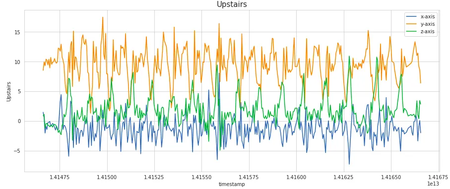
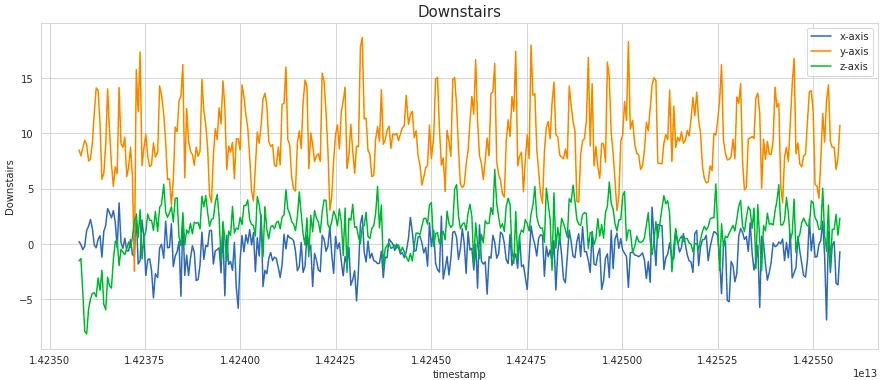
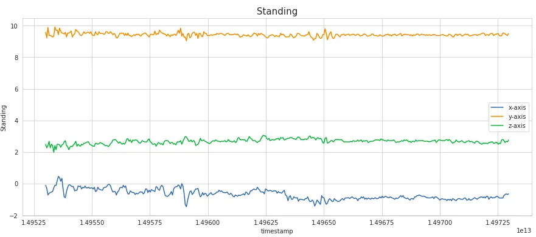
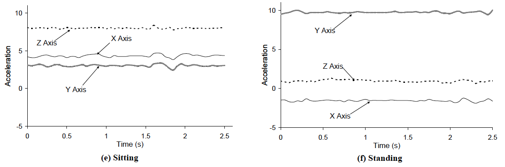

## Human Activity Recognition
{: .no_toc }

## Table of Contents
{: .no_toc .text-delta }

1. TOC
{:toc}
---

## Visualizing Common Activities 

Let us consider six activities: walking, jogging, ascending stairs, descending stairs, sitting, and standing. We selected these activities because they are performed regularly by many people in their daily routines. The activities also involve motions that often occur for substantial time periods, thus making them easier to recognize. Furthermore, most of these activities involve repetitive motions and hopefully this should also make the activities easier to recognize.

<!---

  
  
  
  
  
  

  
  
  

_Figure 1: Accelerometer data for common activities corresponding to one individual (data from [2])_
--->

**Directional sensitivity of accelerometer.** To aid in recognition, it's crucial to understand the directional sensitivity of accelerometers:
- X-Axis: Captures horizontal movement of the user’s leg.
- Y-Axis: Reflects upward and downward motion.
- Z-Axis: Represents the forward movement of the leg.

It's worth noting that the Y-values typically have the most significant accelerations across activities. This prevalence is attributed to Earth’s gravitational pull, which leads to a consistent 9.8 m/s^2 acceleration in the direction of the Earth’s center. For all activities, barring sitting, this direction predominantly aligns with the Y-axis.

  
  

_Figure 1: Accelerometer data for sitting and standing (viz. from [1])_

**Sitting and Standing.** It is clear that sitting and standing do not exhibit periodic behavior but do have distinctive patterns, based on the relative magnitudes of the x, y, and z, values. The primary difference between sitting and standing is the relative magnitudes of values for each axis, due to the different orientations of the device with respect to the Earth when the user is sitting and standing. Thus it appears easy to differentiate between sitting and standing, even though neither involves much movement. 

  
  
  
  

_Figure 2: Accelerometer data for walking, jogging, ascending/descending stairs (viz. from [1])_

**Walking, jogging, ascending/descending stairs.** The periodic patterns for walking, jogging, ascending stairs, and descending stairs can be described in terms of the time between peaks and by the relative magnitudes of the acceleration values. The plot for walking demonstrates a series of high peaks for the y-axis, spaced out at approximately ½ second intervals. The peaks for the z-axis acceleration data echo these peaks but with a lower magnitude. The distance between the peaks of the z-axis and y-axis data represent the time of one stride. The x-axis values (side to side) have an even lower magnitude but nonetheless mimic the peaks associated with the other axes. 

For jogging, similar trends are  seen for the z-axis and y-axis data, but the time between peaks is less (~¼ second), as one would expect. The range of y-axis acceleration values for jogging is greater than for  walking, although the shift is more noticeable in the negative direction. 

For descending stairs, one observes a series of small peaks for y axis acceleration that take place every ~½ second. Each small peak represents movement down a single stair. The z-axis values show a similar trend with negative acceleration, reflecting the regular movement down each stair. The x-axis data shows a series of semi-regular small peaks, with acceleration vacillating again between positive and negative values. 

For ascending stairs, there are a series of regular peaks for the z-axis data and y-axis data as well; these are spaced approximately ~¾ seconds apart, reflecting the longer time it takes to climb up stairs. 

Having looked at the data for the activities that we want to distinguish, let's turn our attention back to designing the classifier that will automatically determine user state.

### References

1. [Feature Engineering on Time-Series Data for Human Activity Recognition](https://towardsdatascience.com/feature-engineering-on-time-series-data-transforming-signal-data-of-a-smartphone-accelerometer-for-72cbe34b8a60), Pratik Nabriya

