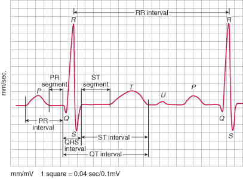
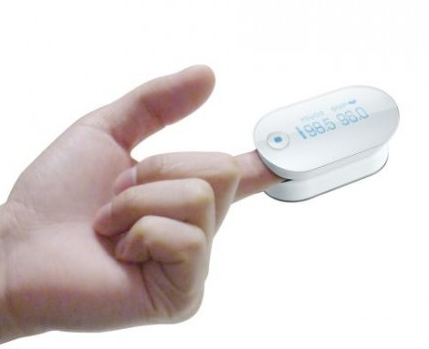
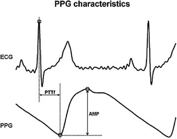

## Table of Contents
{: .no_toc .text-delta }

1. TOC
{:toc}
---

## Analysis of ECG and PPG waveforms.

In this note, we will look briefly at how to extract key metrics like heart rate and breathing rate from ECG and PPG waveforms.

### Electrocardiogram (ECG)

ECG (or EKG) is a recording of the electrical activity of the heart. With each heartbeat, an electrical signal spreads from the top of the heart to the bottom. As it travels, the signal causes the heart to contract and pump blood. The process repeats with each new heartbeat. The heart's electrical signals set the rhythm of the heartbeat. This can be measured by placing two electrodes at different points on the chest, and measuring the electrical activity between these electrodes.

An ECG shows how fast your heart is beating, the rhythm of your heartbeat (steady vs irregular), and the strength and timing of the electrical signals as they pass through each part of the heart. Lets take a look at a typical ECG signal, and what types of features are useful to extract from the ECG signal.

A typical ECG wave looks as shown in the figure above. Each heartbeat comprises a sequence of peaks and trough, labeled P, Q, R, S, and T as shown in the figure. Occasionally, there is a U wave after T as well. This pattern repeats as long as a person’s heart is beating. 

### How do you detect peaks and troughs in an ECG waveform?

You might be thinking that these peaks and troughs look quite similar to the step detector that we discussed in Lesson 2. Indeed, the peak detection algorithm that we used for the step detector is indeed a good starting point for detecting the peaks and troughs in ECG. As with step detection, you look for a change in the slope from positive to negative (peak) or negative to positive (trough). You then look at the sequence information to label the appropriate peaks (P, Q, R, S, T).

### How to extract ECG features?

Once you have the five (or six) peaks and troughs, the timing differences between them are useful features for classification. For example, you can extract the RR interval, PR interval, the QRS interval, the QT interval, the ST interval, and so on, and look at how these intervals vary to detect abnormalities in the heart. 

Obtaining heart rate from ECG is quite straightforward once you have the RR interval. Each RR interval corresponds to the time between two successive heartbeats, so you just need to compute the number of RR intervals in one minute, which is _HR = 60 &‌divide; RR_ (when RR is measured in seconds).

You can also measure the breathing rate from heart rate information,  photoplethysmography (PPG) in the next section.

## Photoplethysmography (PPG)

Photoplethysmography is a non-invasive technique for measuring blood volume changes in the blood vessels close to the skin. PPG has become a popular non-invasive method for extracting physiological measurements such as heart rate and oxygen saturation. PPG is typically measured by a device called a pulse oximeter, that is worn like a cap on the index finger (on the left below). 

But what makes PPG particularly appealing is that it can be measured using a built-in cellphone camera without any  additional hardware. Well, almost no additional hardware, since its often useful to have a cap as shown on the right below to block out ambient light.  By placing the index finger over the cellphone camera with its flash turned on, the camera records the light absorbed by the finger tissue. Then, from the video, each frame is processed by splitting every pixel into red, green and blue (RGB) components, which are then processed to extract heart rate and breathing rate.

  
  

There are many apps that are available on the Android Store and iOS App Store that use photoplethysmography --- some examples are _[Whats my Heart Rate](https://play.google.com/store/apps/details?id=com.vitrox.facion.gui&hl=en)_, which is an Android App, and _[Instant Heart Rate ](http://itunes.apple.com/us/app/instant-heart-rate-by-azumio/id395042892)_and _[Cardiograph](http://itunes.apple.com/us/app/cardiograph/id441079429)_, which are iPhone apps. Lets take a look at how these apps work. 

  
  

### How to extract Heart Rate (HR) from PPG?

During the cardiac cycle, when the heartbeats, it creates a wave of blood that reaches the capillarity at the tip of the finger, when the capillarity is full of  blood, less light passes through and the finger. When the blood retracts, more light can pass through the tissue. If these  changes are recorded over time, a waveform is going to be created  that correspond to the pulsatile changes in the arterial blood in that tissue. These changes in the arterial blood volume correspond to the heart rate. This process is known as PPG. Using the method described above we try to detect the cardiac waveform and from that the heart rate.

Heart rate estimation from the signal is as follows. From the recorded video, the green values from every frame were extracted in order to acquire the PPG signal. The green intensity average in the PPG signal formed peaks that correspond to cardiac pulse. A peak detection algorithm was used in order to find all the cardiac peaks in the signal. A peak is defined as the highest average of green values in a fixed window size (typically ~0.7 seconds). Once a peak was found, the time difference between consecutive peaks was computed. This time difference is known as R-R interval (RRI). From the R-R interval values the HR was estimated as _HR = 60 &‌divide; RR_ (when RR is measured in seconds).

### How to extract Breathing Rate (BR) from PPG?

Interestingly, the PPG signal can be used for extracting not just the heart rate but also the breathing rate of the individual. The reason why this is possible is because of a phenomenon called Respiratory sinus arrhythmia (RSA), which is a naturally occurring variation in heart rate that occurs during a breathing cycle. Heart rate increases during inspiration and decreases during expiration! Were you aware of this? We will skip the biological reasons for RSA, and focus on how to extract breathing rate from PPG.

To view this behavior in a real dataset, focus on the blue curve in the figure below (ignore the red curve for now). The blue curve plots the average green intensity per frame. As we expected, the green intensity goes up and down for each heartbeat. But you can also see that there is another periodic pattern that is visible --- the green intensity for each heartbeat is not identical, in fact the green intensity seems seems to spike every few heartbeats and go down after that. This pattern is caused by RSA as described earlier -- the R-R interval on an ECG is shortened during inhalation and prolonged during exhalation.

How do we go about extracting the respiration rate (RR)? One method is to look for the frequency of changes in the heart rate (which in turn corresponds to the breathing rate). Whenever we want frequency domain information, we use an FFT to convert from time to frequency domain, and take the dominant frequency from the FFT. This is exactly what we do to obtain the respiration rate from the PPG signal. Note that the breathing waveform can be noisy and somewhat difficult to extract precisely from PPG. So, an FFT may not always work as expected.

That completes our analysis of how PPG can be used to extract heart rate and breathing rate. To summarize, a) first, we get the average green intensity per frame, b) second, we use peak detection on a short window of samples to extract the RR interval, and from that obtain the HR, and c) third, we perform an FFT on the RR intervals obtained in step (b) to obtain the RR. The only thing left for you to do is to try this out on your smartphone!

## References

[Extracting Heart Rate and Respiration Rate using a Cell Phone Camera ](https://parasol.tamu.edu/dreu2013/Jimenez/documents/EXTRACTING%20HEART%20RATE%20AND%20RESPIRATION%20RATE%20USING%20A%20CELL%20PHONE%20CAMERA.pdf)- Jimenez, Parnandi, Gutierrez-Osuna
