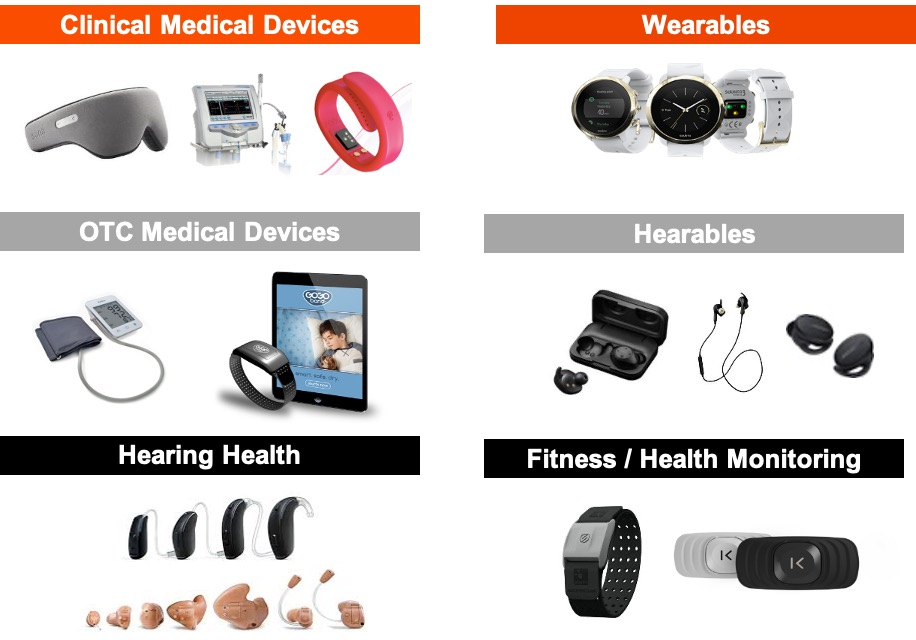
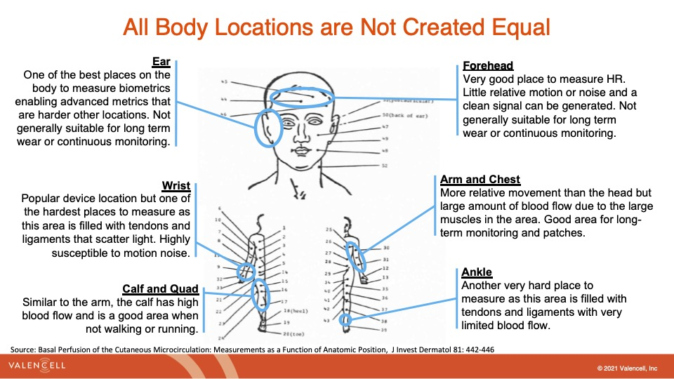
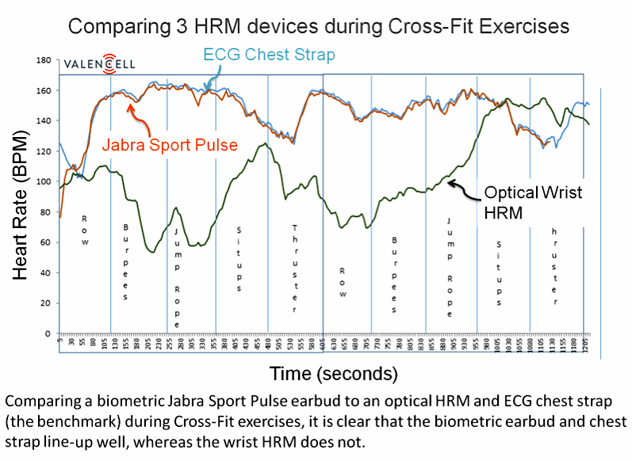

## Table of Contents
{: .no_toc .text-delta }

1. TOC
{:toc}
---

## Measuring Heart Rhythm via Photoplethysmography (PPG)

_This note is adapted from Valencell's excellent post on [Optical Heart Rate Monitors](https://valencell.com/blog/optical-heart-rate-monitoring-what-you-need-to-know/)._

Optical heart rate monitors are used in a variety of wearable devices today including wrist bands, smartwatches, audio earbuds, pulse oximeters, hearing aids and many more. These monitors are driving a wide variety of use cases and applications today. We typically see three primary scenarios:

1\. Lifestyle – Typically this involves tracking variables like steps, basic movement, resting and/or casual heart rate, etc. Comfort and style are typically valued over accuracy in this scenario, although this is changing with rising consumer interest in health and fitness analysis.

2\. In-session – Focused on real-time biometric measurement during a specific activity such as working out, running, biking or even fighting a fire. Stability and accuracy are highly valued in these scenarios.

3\. Personal Health – Ongoing measurement of personal health indicators such as heart rate, blood pressure, oxygen saturation, etc. These measurements can be used in conjunction with a prevention plan (in healthy populations) or a disease management plan (for those managing a health condition such as hypertension, diabetes, cardiovascular disease, etc.).  Accuracy and comfort are highly valued in these scenarios.

_Figure 1: Common use cases of PPG monitors._

## How does Optical Heart Rate Monitoring work?

Most wearables with heart rate monitors today use a method called [photoplethysmography (PPG)](https://en.wikipedia.org/wiki/Photoplethysmogram) to measure heart rate. PPG is a technical term for shining light into the skin and measuring the amount of light that is scattered by blood flow. That’s an oversimplification, but PPG sensors are based on the fact that light entering the body will scatter in a predictable manner as the blood flow dynamics change, such as with changes in blood pulse rates (heart rate) or with changes in blood volume (cardiac output).

PPG sensors use four primary technical components to measure heart rate:

1\. Optical emitters – generally at least 2 LED’s that send light waves into the skin, although some PPG sensors are adding more emitters and varying light wavelengths. Because of the wide differences in skin thickness, tone and morphology associated with a diversity of people, most state-of-the-art optical heart rate monitors use multiple light wavelengths that interact differently with different levels of skin and tissue.

2\. Photodetector(s) – the photodetector captures the light refracted from the user of the device and translates those signals into one’s and zero’s that can be calculated into meaningful heart rate data.

3\. Accelerometer – the accelerometer measures motion and is used in combination with the photodetector signal as inputs into PPG algorithms.

4\. Algorithms – the algorithms process the signals from the photodetector and the accelerometer into motion-tolerant heart rate data, but can also calculate additional biometrics such as calories burned, R-R interval, heart rate variability, and blood oxygen levels.

_Figure 2: MEMS Motion Sensor - Optical Sensors_

## History of PPG

PPG is actually almost 150 years old, but it has been revolutionized in the 21st century for new use cases. Real-time optical blood flow monitoring was first used in the late 1800s by having people hold their hand up to a candle in a dark room to see the vascular structure and blood flow. More recently in the early 1980s, the first pulse oximeters were launched for hospital use, measuring pulse rate and blood oxygen using two alternating LEDs. These are very similar to the finger or ear clip devices still used in healthcare facilities today.

PPG sensor developments in the last 5-10 years have focused on consumer and medical wearable devices and services. This required a radical development known as motion-tolerant PPG because using PPG sensors during motion and activity massively increases the amount of motion noise that must be removed to find the blood flow signal.

Here’s a brief visual history of PPG sensors:

_Figure 3: Optical heart rate monitoring - technology timeline._

## What are the primary challenges with optical heart rate monitors?

PPG sounds relatively simple, but it’s actually very difficult to implement accurately for wearables. Measuring PPG during a resting state (sleeping, sitting, and standing still) is relatively straightforward, but measuring PPG during physical activity is incredibly complex. There are five fundamental challenges that one faces in analyzing PPG signals:

1\. _**Optical noise**_ – The biggest technical hurdle in processing PPG sensor signals is separating the biometric signal from the noise, especially motion noise. Unfortunately, when you shine light into a person’s skin only a small fraction of the light returns to the sensor, and of the total light collected, only ~1/1000th of it may actually indicate heart-pumped blood flow. The rest of the signals are simply scattered by other material, such as skin, muscle, tendons, etc.

2\. _**Skin tone**_ – Humans have a diverse range of skin tones and different skin tones absorb light differently. For example, darker skin absorbs more light, which presents a problem because many optical heart rate monitors don’t use the right mitigations to accurately measure heart rate through dark skin. This also presents a problem for measuring heart rate through tattooed skin, which Apple found out the hard way in what became known as “tattoogate” when people with wrist tattoos found that the heart rate monitor on the Apple Watch performed poorly – or not at all – for them.

3\. _**Crossover problem**_ – One of the most challenging aspects of optical noise for optical heart rate monitors that is created by motion and activity happens during what is known as periodic activity, which is an activity that involves continuous repetition of similar motion. This is most often seen in the step rates measured during jogging and running because step rates typically fall into the same general range as that of heartbeats (140-180 beats/steps per minute). The problem that many optical monitors face is that it becomes easy for the algorithms interpreting incoming optical sensor data to mistake step rate (“cadence”) for heart rate. This is known as the **crossover problem**, because if you look at the measurements on a graph when the heart rate and step rate crossover each other, many optical heart rate monitors tend to lock on to step rate and present that number as the heart rate, even though the heart rate may be changing drastically after the crossover.

4\. _**Sensor location**_ – Heart rate monitoring presents unique challenges that vary significantly by location. It turns out that the wrist is a poor location for accurate PPG monitoring of heart rate because of the much higher optical noise created in that region (muscle, tendon, bone, etc.) and because of the high degree of variability in vascular structure and blood [perfusion](https://en.wikipedia.org/wiki/Perfusion) across the human populations. The forearm is considerably better because of the higher density of blood vessels near the surface of the skin. The ear is a great location on the body for PPG monitoring because it is essentially just cartilage and blood vessels, which don’t move much even when the body is in vigorous motion, thereby drastically reducing the optical noise that must be filtered.

5\. _**Low perfusion**_ – Perfusion is the process of a body delivering blood to capillary beds. As with skin tone, the level of perfusion is highly variable across populations, with issues such as obesity, diabetes, heart conditions, and arterial diseases each lowering blood perfusion. Low perfusion, especially in the body’s extremities where most wearable devices are located, can present challenges for optical heart rate monitors because the signal-to-noise ratio may be drastically reduced, as lower perfusion correlates with lower blood flow signals. The head region (including the ear, temple, and forehead) supports much higher perfusion and better quality photoplethysmograms than the wrists or feet.

<!---

--->

  
  

## How do we improve PPG monitoring quality?

PPG is obviously very difficult to measure accurately, particularly from the wrist but wearable devices are getting better at it. At a high level, this requires advances in optomechanics (hardware design) and signal processing/machine learning algorithms (software). Here are a few ways of improving the signal analysis algorithm.

1.  Have the algorithms been validated on a diverse population set? It’s important to make sure the device works on different skin tones, genders, health conditions, body types and levels of fitness, etc.
2.  Are the algorithms robust to multiple types of motion noise? The algorithms must be able to work during different activities, including walking, running (high-speed steady runs and interval training), sprinting, gym activities (weight lifting, Crossfit, etc.) and everyday life activities like typing on a computer, talking on the phone, or riding in a vehicle.
3.  Is the signal extraction methodology scalable to multiple form factors i.e. devices? You don’t want to have to use different algorithms for each different form factor you may want to use.

## What metrics can you get from PPG sensors?

While PPG is really hard to get right, when you do get it right, it can be very powerful. A high-quality PPG signal is foundational to a wealth of biometrics that the marketplace is demanding today. Here is a a list of the most common metrics that we can obtain from PPG.

* [Breathing rate](https://en.wikipedia.org/wiki/Respiratory_rate) – breathing rate is the number of breaths taken in a period of time (typically 60 seconds) and lower resting breathing rates are generally correlated with higher levels of fitness.
* [Blood oxygen levels (SpO2, oxygen saturation)](https://en.wikipedia.org/wiki/Oxygen_saturation_(medicine)) – blood oxygen levels indicate the concentration of oxygen in the blood. The latest Apple Watches use this technology.
* [Heart rate variability](https://en.wikipedia.org/wiki/Heart_rate_variability) – Heart rate variability captures the variation in the interval between blood pulses (or ECG beats), and generally the more varied the time between beats, the better. Heart rate variability analysis can be used as an indicator of stress levels and various cardiac issues, among other things.
* Cardiac efficiency – this is another indicator of fitness that typically measures how efficiently your heart works to take one step. This serves as a proxy for how hard your heart would have to work to do more challenging exercises like running or cycling.

You can see below a simplified PPG signal and where each of the biometrics is measured within that signal.

_Figure 6: PPG metrics and how they are extracted._

