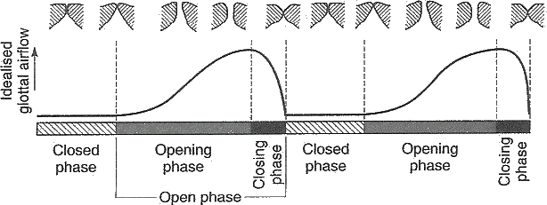
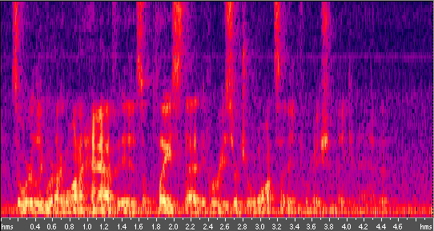
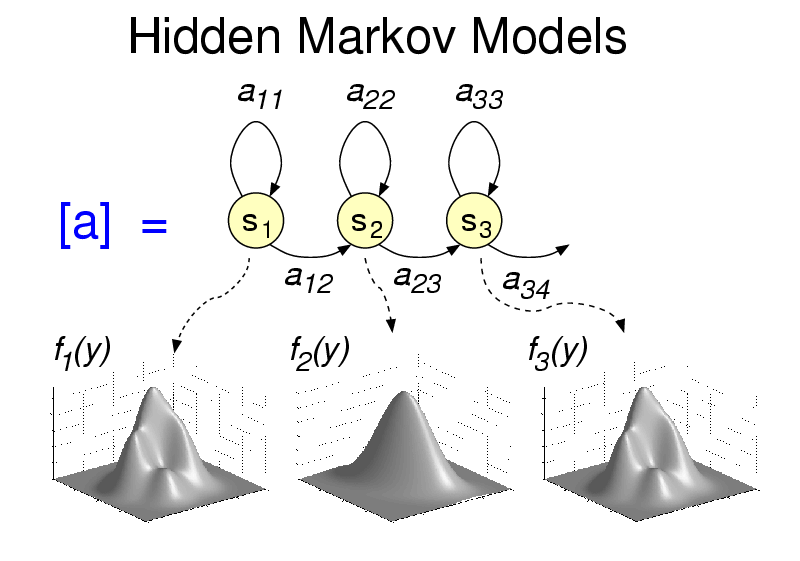

## Voice-based Health Analytics
{: .no_toc }

## Table of Contents
{: .no_toc .text-delta }

1. TOC
{:toc}
---

## Chapter 6: Voice-based Health Analytics

<iframe width="320" height="240" src="https://www.youtube.com/embed/oL5PbFeFMyY" title="YouTube video player" frameborder="0" allow="accelerometer; autoplay; clipboard-write; encrypted-media; gyroscope; picture-in-picture" allowfullscreen></iframe>

<iframe width="320" height="240" src="https://www.youtube.com/embed/IliokKSNuXQ" title="YouTube video player" frameborder="0" allow="accelerometer; autoplay; clipboard-write; encrypted-media; gyroscope; picture-in-picture" allowfullscreen></iframe>

Voice is an extremely useful and important part of health analytics. There are many interesting questions that can be answered with audio processing -- for example, how much social interaction does a person engage in? what is the emotional content of the voice? and so on. These indicators can be leveraged for understanding depression, stress, mood, and many other factors that are relevant to personal health. 

In this chapter, we will look at some interesting ways in which voice processing can be used for obtaining measures of health. We will start with a discussion of useful speech features, and then proceed to some case studies where these features were used to determine contextual information.

### Voice Feature: Mel-frequency Spectral Coefficients (MFCC)

<iframe width="320" height="240" src="https://www.youtube.com/embed/4SnsKeb1ljA" title="YouTube video player" frameborder="0" allow="accelerometer; autoplay; clipboard-write; encrypted-media; gyroscope; picture-in-picture" allowfullscreen></iframe>

As with accelerometer data, the core of a voice-based emotion sensing approach is obtaining good features. Perhaps the most important feature and widely used in voice is Mel-frequency Spectral Coefficients (MFCC).

MFCC is such a useful voice feature that it deserves to be discussed on its own. The MFCC feature (and variants) has been heavily used in speech recognition, for example, it is part of how the Siri software on an iPhone recognizes your command. 

##### What exactly is MFCC and how does it work? 

Sounds generated by a human are filtered by the shape of the vocal tract including tongue, teeth etc. This shape determines what sound comes out. If we can determine the shape accurately, this should give us an accurate representation of sound being produced, which in turn can help us design speech processing systems. 

The idea in MFCC is to extract features that closest to human perception of voice, since we care about humans interpret speech. The Mel scale relates perceived frequency, or pitch, of a pure tone to its actual measured frequency. Humans are much better at discerning small changes in pitch at low frequencies than they are at high frequencies. Incorporating this scale makes our features match more closely what humans hear.

#### The MFCC computation pipeline

The pipeline by which speech is converted to MFCC features is shown above. The figure looks daunting at first glance, but we will focus on providing you a high-level intuition of how to obtain MFCC features, and how these features work. 

**Step 1: Windowing.** Audio is continuously changing, so we break it down into short segments where we assume that things have been relatively constant. The tradeoff is that if our window is too short, we have too few samples to obtain a consistent result, and if it is too long, we have too many samples to obtain a good result. Typically, voice is broken down into 20-40ms segments.

**Step 2: Power spectrum.** The next step is to calculate the power spectrum of each frame. This is motivated by the human cochlea (an organ in the ear) which vibrates at different spots depending on the frequency of the incoming sounds. Depending on the location in the cochlea that vibrates (which wobbles small hairs), different nerves fire informing the brain that certain frequencies are present. Our periodogram estimate performs a similar job for us, identifying which frequencies are present in the frame.

**Step 3. Apply Mel Filterbank.** The periodogram spectral estimate still contains a lot of information that is unnecessary for speech recognition. In particular the cochlea can not discern the difference between two closely spaced frequencies. This effect becomes more pronounced as the frequencies increase. So, this step is just a way to combine the frequency spectrum into bins that is similar to how our ear perceives voice. The first filter is very narrow and gives an indication of how much energy exists near 0 Hertz where human hearing is very sensitive to variations. As the frequencies get higher our filters get wider as we become less concerned about variations. 

The formula for converting from frequency to Mel scale is:

To go from Mels back to frequency:

**Step 4. Logarithm of the Mel filterbank.** Once we have the filterbank energies, we take the logarithm of them. This is also motivated by human hearing: we don't hear loudness on a linear scale. Generally to double the percieved volume of a sound we need to put 8 times as much energy into it. This means that large variations in energy may not sound all that different if the sound is loud to begin with. This compression operation makes our features match more closely what humans actually hear. 

**Step 5. DCT of the log filterbank.** The final step is to compute the DCT of the log filterbank energies. This step is a bit harder to understand without a signal processing background. Intuitively, the idea is that there are a lot of correlations between the log filterbank energies, and this step tries to extract the most useful and independent features.

At the end of the DCT, you get 13 MFCC coefficients; typically, these are combined with a few other features extracted through the same pipeline such as first derivative and second derivative coefficients. We won’t discuss them in detail here. Together, you get a 39 element acoustic vector that are the core features used in speech processing algorithms.

### Other Audio Features

<iframe width="320" height="240" src="https://www.youtube.com/embed/q4FqA5AxzEg" title="YouTube video player" frameborder="0" allow="accelerometer; autoplay; clipboard-write; encrypted-media; gyroscope; picture-in-picture" allowfullscreen></iframe>

<iframe width="320" height="240" src="https://www.youtube.com/embed/Zs-U2qARfcI" title="YouTube video player" frameborder="0" allow="accelerometer; autoplay; clipboard-write; encrypted-media; gyroscope; picture-in-picture" allowfullscreen></iframe>

While MFCC are a very useful feature, this by no means the only one. In fact, there are many other features that are particularly useful in understanding emotional content of speech. Emotional speech processing tries to recognize the user's emotional state by analyzing speech patterns. 

You might wonder how features that capture emotion differ from those described above and used in speech processing. The distinction is that when we discussed MFCC and related features, we wanted to capture the _content of sound_, whereas with emotion processing, we want to capture the _sound characteristics a.k.a. prosody_. An intuitive distinction is that the content is about the words in speech, i.e., what we are saying, whereas the prosody is about the sound characteristics of speech, i.e., how we say it. In terms of acoustics, the prosodics of oral languages involve variation in syllable length, loudness, pitch, and the formant frequencies of speech sounds. We discuss some of these features below.

* **Pitch:** Pitch describes how a listener perceive a sound. A sudden increase in pitch can often be perceived as high activation, such as anger, whereas low variance of pitch is often conceived as low energy, for example, sadness. 
* **Intensity:** The intensity reflects the effort to produce speech. Studies showed that angry utterance usually displays rapid rise of energy, and on the contrary sad speech usually is characterized by low intensity. Based on the observation, we need features that can describe the overall energy level and some momentary energy `onset' and `offset'.
* **Temporal Aspects:** In temporal aspects are measures that can describe speech rate and voice activity (i.e., pauses). Some research showed that those two temporal properties may be affected by emotions. For example, sadness often result in slower speech and more pauses. 

* **Voice Quality:** Emotions may also influence the voice quality of utterances. For example, some voice becomes sharp or jagged while some voice sounds soft. Glottal waveforms are useful to describe these sound characteristics. As illustrated in the above figure, a glottal (flow) waveform represents the time that the glottis is open (with air flowing between vocal folds), and the time the glottis is closed for each vibrational cycle. In addition, an open phase can be further broken down into opening and closing phases. If there is a sudden change in air flow (i.e., shorter open and close phases), it would produce more high frequency and the voice therefore sounds more jagged, other than soft. To capture it, we need features that describe timings of the phases and the ratios of closing to opening phase, open phase to total cycle, closed phase to total cycle, opening to open phase, and closing to open phase. 

* **Spectrogram:** A spectrogram can describe the energy distribution across frequency bands (as shown above). The reason was that the emphasis on certain frequency may be speaker dependent and may be used to reflect emotions.
* **Other Statistical Measures:** There are several basic statistical measures, which can help represent all possible dynamics which might be affected by emotions.

### Voice Analysis Library: Classification

We’re now going to look at how the different features listed above can be used in a variety of classification tasks. Audio classification is a vast field, and a detailed description of the technique will require both substantial time and significant mathematical maturity. So, we stay at a more superficial level, and try to provide you an idea of the techniques so that you can explore on your own if you are interested. We start with speech processing (e.g. Siri), and then discuss one example of an emotion recognition system.

#### Speech processing

Speech processing is a field that has seen a huge amount of work. There are complex models, and complex algorithms underlying them that are out of scope for this class. Our goal here is only to introduce the ideas so that you are familiar with how a basic speech processing system can be constructed.

Human speech can be broken into phonemes -- for example, when you look up a word in a dictionary, you get the phonetic pronunciation of the word, which is a combination of phonemes. An example of a phoneme in English is /k/, which occurs in words such as **_cat_**, **_kit_**, _s**ch**ool_, _s**k**ill_, **_kite._**

The challenge in speech recognition is to recognize a sequence of phonemes as a particular word. In the example above, lets say a word starts with the phoneme /k/ (assume for the moment that we can identify start of words). There are a huge number of words that start with the phoneme  /k/, so how does the system identify which is the word being spoken? 

To do this, speech recognizers use temporal models such as a Hidden Markov Model (HMM). At a high level, a HMM for each letter in the alphabet tries to look for a sequence of phonemes, while taking into account the fact that different people pronounce letters differently (therein the distribution shown below each circle in the figure below).

Hidden Markov Models are extremely powerful, and can be composed to identify letters, then words, and then sentences as shown below. 

As described earlier, the most useful feature for speech recognition is the acoustic feature vector (MFCC + others). These are the core features that are used to distinguish between different phonemes, and thereby the different letters, words, sentences, etc.

#### Diagnosis of Mental Illnesses

Mental illness such as depression are well known to have substantial effect on voice. Table 1 shows the aspects of speech that mental health practitioners pay particular attention to when performing a mental state examination of patients. These parameters help describe a patient's current state of mind, under the domains of appearance, attitude, behavior, mood and affect, speech, thought process, thought content, perception, cognition, insight and judgment. For example, depressed patients often express slow responses (longer response time to questions and pause time within sentences), monotonic phrases (less fundamental frequency variability), and poor articulation (slower rate of diphthong production). On the other hand, the spectrum of agitated behavior includes expansive gesturing, pacing and hair twirling. As can be seen, many of the prosodic features capture these variations; in addition, speech related features such as MFCC capture speech intensity. 

<table>
  <tr>
   <td>Category
   </td>
   <td>Patterns
   </td>
  </tr>
  <tr>
   <td>Rate of speech
   </td>
   <td>slow, rapid
   </td>
  </tr>
  <tr>
   <td>Flow of speech
   </td>
   <td>hesitant, long pauses, stuttering
   </td>
  </tr>
  <tr>
   <td>Intensity of speech
   </td>
   <td>loud, soft
   </td>
  </tr>
  <tr>
   <td>Clarity
   </td>
   <td>clear, slurred
   </td>
  </tr>
  <tr>
   <td>Liveliness
   </td>
   <td>pressured, monotonous, explosive
   </td>
  </tr>
  <tr>
   <td>Quality
   </td>
   <td>verbose, scant
   </td>
  </tr>
</table>

_Table 1: Speech Descriptors in Mental Status Exam_

### Monitoring Affect with a Mobile Phone

There are many interesting applications for affect/mental health monitoring by voice. Consider the following examples:

**Cell-phone monitoring of healthy subjects as part of a health-care package.** Using voice analysis algorithms on the phone itself, the voice is analyzed during cell phone conversations. Subjects are directly informed if problems are detected by the voice analysis software. In the early stages, they are likely to seek treatment in many cases. Rather than individual sign-up, this would be part of a health “package" from a provider which includes physical health as well. 

**Subsidized “calling-card" number for at-risk populations.** Subjects can make free calls on a normal phone using a special access number. This number routes calls through a cloud of servers where voice is analyzed. Distinct access codes would allow per-patient tracking. This method should be cost effective for many chronic conditions such as AIDS where mentally ill patients add severe cost overhead due to wasted (not taken) medication and (corollary) drug-resistance strains of the virus.

**Monitoring of human-computer speech interfaces and interpersonal speech for elders in assisted or independent care.** Environmental monitors (array microphones that work 10-20 feet from subjects) can be used to gather incidental speech between subjects. For subjects living alone, speech interfaces may be introduced as a convenient way for subjects to access email, text messages, news, weather and personal schedule information. These routine services provide regular opportunities to intercept and analyze their speech for mental health purposes.

**Monitoring our stress in everyday lives. **Microphones, embedded in mobile phones and carried ubiquitously by people, provide the opportunity to continuously and non-invasively monitor stress in real-life situations using an approach very similar to that for identifying depression. Everyone experiences stressful situations, either because of work pressures, exams, personal circumstances, or others. Maybe your phone can inform you that you should do something about your stress levels, perhaps play calming music, or take a break.

**Monitoring Social Interactions (or lack of it).** Your phone can recognize when there is conversation in the vicinity (using speech-based features), and also whether you are speaking or someone else (since individuals have distinctive speech patterns). Using this information, your phone may be able to monitor your daily social interactions, and identify whether you have gone long periods without contact with someone (a common problem in the digital age). Maybe it can give you notifications that its time to get off your computer and socialize!

### Conclusion

Speech and sound is extremely important in our lives, and an amazing amount of information can be gleaned from recorded audio from a simple microphone. As microphones become more powerful and more ubiquitous, the possibility that computing systems will be able to monitor 24/7 and identify changes in health patterns has exciting possibilities for understanding ourselves and in anticipating problems. But it also presents many roadblocks, not just in the audio data analysis, but also in making sure people’s privacy is not violated in the process. 

### References

[1] Speech Emotion Classification using Machine Learning Algorithms, S. Casale, A. Russo, G. Scebba

[2] [Speech Analysis Methodologies towards Unobtrusive Mental Health Monitoring](http://www.eecs.berkeley.edu/Pubs/TechRpts/2012/EECS-2012-55.pdf), Keng-hao Chang

[3] OpenEAR - Introducing the Munich Open-Source Emotion and Affect Recognition Toolkit, Florian Eyben, Martin Wollmer, and Bj ¨ orn Schuller

[4] StressSense: Detecting stress in unconstrained acoustic environments using smartphones, Lu, H., Frauendorfer, D., Rabbi, M., Mast, M. S., Chittaranjan, G. T., Campbell, A. T., ... & Choudhury, T. 
