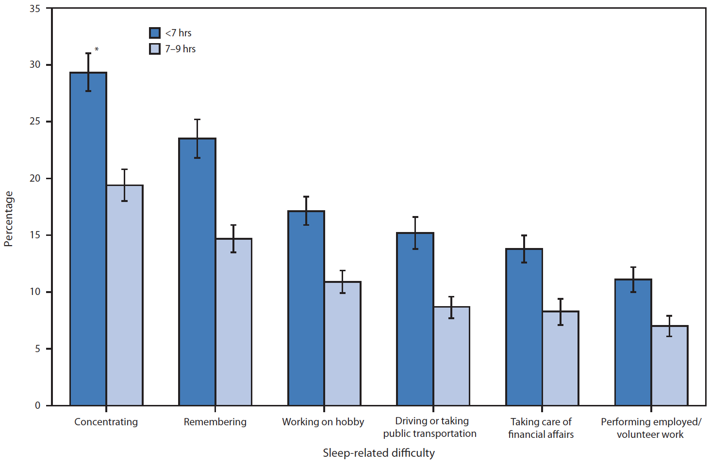
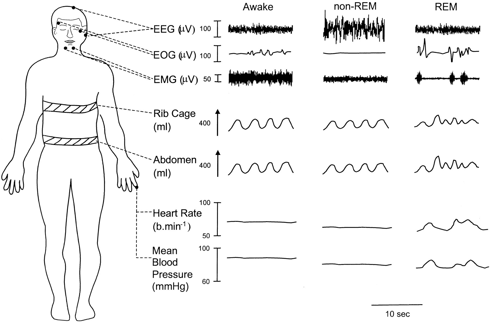
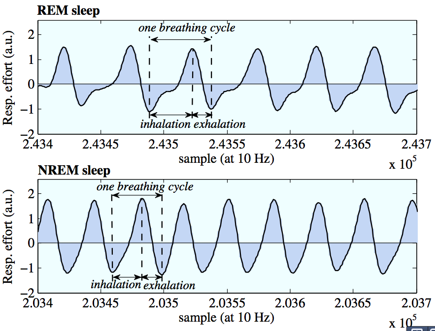
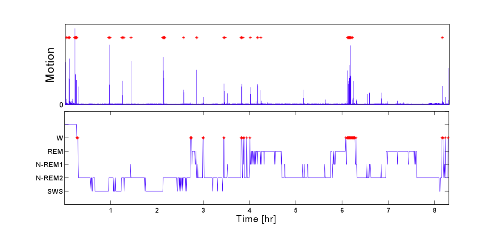
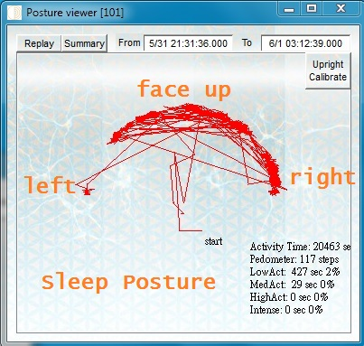

## Measuring Sleep Patterns
{: .no_toc }

## Table of Contents
{: .no_toc .text-delta }

1. TOC
{:toc}
---

## Chapter 6: Measuring Sleep Patterns

<iframe width="320" height="240" src="https://www.youtube.com/embed/Q2BbSzMHyBU" title="YouTube video player" frameborder="0" allow="accelerometer; autoplay; clipboard-write; encrypted-media; gyroscope; picture-in-picture" allowfullscreen></iframe>

<iframe width="320" height="240" src="https://www.youtube.com/embed/LKncR3ZGFxY" title="YouTube video player" frameborder="0" allow="accelerometer; autoplay; clipboard-write; encrypted-media; gyroscope; picture-in-picture" allowfullscreen></iframe>

<iframe width="320" height="240" src="https://www.youtube.com/embed/UOnCaLuj9Ec" title="YouTube video player" frameborder="0" allow="accelerometer; autoplay; clipboard-write; encrypted-media; gyroscope; picture-in-picture" allowfullscreen></iframe>

Sleep is increasingly recognized as important to public health, with sleep insufficiency linked to motor vehicle crashes, industrial disasters, and medical and other occupational errors. Unintentionally falling asleep, nodding off while driving, and having difficulty performing daily tasks because of sleepiness all may contribute to these hazardous outcomes. Persons experiencing sleep insufficiency are also more likely to suffer from chronic diseases such as hypertension, diabetes, depression, and obesity, as well as from cancer, increased mortality, and reduced quality of life and productivity. Sleep insufficiency may be caused by broad scale societal factors such as round-the-clock access to technology and work schedules, but sleep disorders such as insomnia or obstructive sleep apnea also play an important role. An estimated 50-70 million US adults have sleep or wakefulness disorder. Notably, snoring is a major indicator of obstructive sleep apnea.

Two new reports on the prevalence of unhealthy sleep behaviors and self-reported sleep-related difficulties among U.S. adults provide further evidence that insufficient sleep is an important public health concern.

### Sleep-Related Unhealthy Behaviors

One of the major surveys conducted by the Center for Diseases and Control is on Behavioral Risk Factor Surveillance. In 2008, this questionnaire included a question on perceived insufficient rest or sleep. The analysis [2] determined that, among 74,571 adult respondents in 12 states, 35.3\% reported &lt;7 hours of sleep during a typical 24-hour period, 48.0\% reported snoring, 37.9\% reported unintentionally falling asleep during the day at least once in the preceding month, and 4.7\% reported nodding off or falling asleep while driving at least once in the preceding month. The National Department of Transportation estimates drowsy driving to be responsible for 1,550 fatalities and 40,000 nonfatal injuries annually in the United States. 

Sleep also affects ability to perform daily activities, as shown in the figure below. The two bars show the fraction of people who responded to the survey who had difficulty performing the specific activity. The dark blue bar corresponds to individuals who had difficulty while sleeping less than 7 hours a day, and the light blue bar corresponds to those who had difficulty in performing the tasks and slept 7-9 hours day. The conclusion seems rather clear - in general, less sleep seems correlated with greater difficulty in concentration, memory,  driving, workplace performance and other daily activities. 

### How Much Sleep Do We Need? And How Much Sleep Are We Getting?

How much sleep we need varies between individuals but generally changes as we age. The National Sleep Foundation suggests that school-age children (5-10 years) need 10-11 hours of sleep daily, teens (10-17 years) need 8.5-9.5 hours, and adults need 7-9 hours. According to data from the National Health Interview Survey, nearly 30\% of adults reported an average of ≤6 hours of sleep per day in 2005-2007. In 2009, only 31\% of high school students reported getting at least 8 hours of sleep on an average school night.

## How to measure sleep using wearable sensors?

The key question in our discussion is how to measure sleep. The traditional approach to sleep research is called polysomnography, an intensive high-fidelity approach that typically requires more than 20 wires to be hooked up to the test subject. This noodle soup of nodes and cables measure everything from brain activity to eye movement, leg movement, breathing rate and heart rate. This is the stuff of sleep labs, and though the measurements are highly detailed and thorough, they come with a catch: it is very cumbersome, and by requiring somebody to go to a sleep lab and get hooked up to be measured, you're inherently messing up the experiment because the conditions have changed.

Here's why: Collecting the data requires the person with sleep troubles to leave their home environment — their own bedroom, their own bed, their own sheets. That's not restful. Plus with all those wires and nodes, the sleep subject is bound to be disturbed by being literally tied down. So while the measurements may be precise and exacting, the experiment may not be replicating the same kind of sleep.

If you have ever participated in a sleep study, you would know that EEG (brain waves) is the most common way of measuring sleep. Of the modalities used in sleep studies, the most important one is EEG, and a wealth of information is available about how different EEG patterns can be used to distinguish between the sleep stages, and understand the quality of sleep. The figure below shows EEG signals for different sleep stages that a typical individual goes through during sleep.

Before we move on, let us first briefly discuss the sleep stages and their importance. It is widely thought that there are four stages of sleep as an individual progressively goes from light to deep sleep. These sleep stages are interspersed with REM sleep, where the brain is alert and one has vivid dreams. While researchers are not entirely sure of the role of all the sleep stages, it is considered that the sleep stages aid physical and mental recovery, and memory consolidation. REM sleep is considered to aid in creative thinking and making new connections between neurons. 

While EEG gives accurate data about sleep stages, as you might imagine EEG is cumbersome for daily sleep sensing, hence we need a more unobtrusive sleep sensing modality. 

Lets look at some of the other sensor modalities that are used in polysomnography. The figure below shows that different sleep stages also induce changes in other physiological parameters like the breathing pattern and ECG waveform.

### Using respiration for sensing sleep

How about using a respiration sensor for measuring sleep? Intuition suggests that your breathing must become slower and more controlled when you sleep, and this is indeed what datasets on sleeping suggest. The figure above shows the breathing pattern when you are in sleep state vs waking state, and shows that you indeed have substantial differences between the REM and non-REL states when it comes to breathing patterns.

Let us delve into this a bit more. If you look at the figure below, you can see that NREM sleep is much more uniform, whereas there is more irregularity, and longer inhalations during REM sleep, perhaps as a result of the dreams! 

Similarly, ECG changes can be observed during different sleep stages, particularly in REM vs Non-REM sleep. 

However, wearing a respiration or ECG sensor on the chest can be quite cumbersome, making this a somewhat intrusive way of measuring sleep stage.

### Using activity for sensing sleep

Can we measure sleep parameters using our trusty accelerometer? One of the most interesting, and non-obvious, uses of a simple accelerometer is for measuring sleep quality. There are three broad categories of consumer sleep tracking devices that use accelerometers. The first is smartphone based “sleep apps” in the iPhone or Android App Stores - you place the device on the mattress, and the accelerometer on the smartphone is used to do the rest. The second is a wristworn accelerometer, and  many fitness bands (fitbit, microsoft band, jawbone up etc) use wrist-based sensors to sense sleep patterns. The third is sleep trackers that require you to place an accelerometer-instrumented measurement pad beneath your mattress, and these can sense tiny movements of the mattress and relay it to a bedside device. This is somewhat similar to the smartphone app-based approach, except that they can use a larger sensing surface underneath the mattress rather than rely on a single point sensor on a smartphone.

Why do we need sleep trackers? Besides just getting information regarding sleep quality, several sleep trackers also provide information regarding lighting levels and environmental noise levels so that you can identify why your sleep quality may have been affected. Another interesting application is as a sleep stage-aware alarm clock. For example, here’s what the “Sleep Cycle” app on iTunes has to say:

“Have you ever woken up feeling completely wrecked when the alarm clock goes off, despite the fact that you have slept “enough” hours? When this happens you have probably been awakened during a deep sleep phase, and your whole day can turn into one long zombie marathon.

Other days you spring out of bed with a smile on your face, feeling completely rested even though you shouldn’t. As the alarm clock goes off, chance seems to play a big role in how your day will become. But does it really have to be that way? This is where the Sleep Cycle alarm clock application comes into play.

During the night you go from light sleep to deep sleep, occasionally entering into a dream state which is called REM-sleep. These are things that your normal alarm clock does not care about, and will go off at the set time regardless of whether you are in a light sleep phase or in the deepest sleep. However, since you move differently in bed during the different phases, the Sleep Cycle alarm clock is able to use the accelerometer in your iPhone to monitor your movement and determine which sleep phase you are in. Sleep Cycle then uses a 30 minute alarm window that ends at your set alarm time and wakes you in your lightest sleep phase.”

So, how do you detect sleep using an accelerometer. Let us first look at classifying when you are asleep vs awake. This should be relatively simple - we tend to move a lot more when we are awake then when we are asleep. The figure below shows the overall accelerometer activity (energy) during a vigilant phase vs while sleeping. Clearly, there are differences that would help classification. 

The figure below shows an example where motion-based detection of the wake state is shown on the top panel, and the ground truth of sleep states is shown below. What type of features would you use for this classification task? Intuitively, you can try to segment data into short time windows (30-60 seconds), and extract the peak acceleration, average acceleration, number of movements, etc for this window, and then feed these features to a classifier that tries to decide whether you are awake or asleep. However, one would have to be careful of confounding states - for example, if you are in front of your computer typing away, can this get detected as being asleep? Or if you are watching television on a couch, can this be classified as being asleep? and so on.

If you are using a smart wristband for sleep detection, one approach to deal with confounders would be to augment the accelerometer energy with also postural information as shown in the figure below. If your wristband has a compass, you can use this sensor to get absolute orientation, but even if it only has an accelerometer, you can narrow down the orientation by just looking at the direction of the gravity vector. Before you sense orientation, however, you will need to calibrate your algorithm since you may not know a priori what direction is face-up vs face-down, but this may be something that only needs to be done once for a device.

The next question is whether we can classify sleep stage.  This is difficult to do in a reliable manner using just an accelerometer, but people have tried! Some of you might have noticed that you tend to have some jerky motions when you are about to slip into a deep sleep mode. The general idea is to take sense this pattern and use them to detect your current sleep stage. However, this is a difficult problem that research or commercial systems haven’t solved yet. (Many claim to identify sleep stage, but results tend to be quite unreliable).

### Using electrodermal activity to sense sleep

Electrodermal activity (EDA) is widely used in psychophysiology and provides a measure of sympathetic nervous system (SNS) activity, where the SNS is one of the main branches of the autonomic nervous system. Some recent wrist-worn devices including the Microsoft Band and Empatica wristbands come equipped with Galvanic Skin Response sensors which measures EDA activity, hence this is another interesting modality that we can use in sleep sensing.

Studies on EDA during sleep have shown that EDA is more likely to appear elevated with high frequency “storm” patterns during deep sleep, where an EDA “storm” region (Burch [5]) refers to a region of EDA with a burst of high frequency peaks. Burch originally quantified a storm as a minimum of five galvanic skin responses (GSRs)/min for at least ten consecutive minutes of sleep, but other studies have used slightly different thresholds. 

Studies on the use of EDA have indicated that EDA storms can distinguish wake and sleep and indicate sleep onset, and can also be used to separate REM sleep from NREM sleep. Features used in this classification included the number of peaks in storms, durations of storms, peak frequency, amplitude and onset time of the first storm. 

While promising, this is an area where there is not solid evidence, so much more remains to be done before it is in widespread use.

### Using radar and ultrasound doppler to sense sleep

All the methods that we have discussed above involve wearable devices, but there have also been studies that have attempted to use passive methods to sense sleep. One technique that has seen recent interest is the use of doppler effect to sense chest movements and thereby detect the respiration and heart-rate patterns, from which information can be gleaned about sleep [9]. 

The underlying idea in this approach is to track fine-grained movements of the chest of an individual who is sleeping by using a doppler ranging radar. The chestwall makes two movements of interest - tiny movements are the result of ballistic movements of the chest every time the heart pumps (ballistocardiography or BCG) and larger movements corresponding to respiration cycles. Both of these can (in principle) be detected using a doppler radar. While interesting, this is certainly early work and needs more work to validate in real-world settings.

### References

1. CDC: Insufficient sleep is a public health problem. National Health and Nutrition Examination Survey (NHANES) - Sleep Disorders Questionnaire Analysis. [Link](http://www.cdc.gov/mmwr/PDF/wk/mm6008.pdf)
2. Institute of Medicine. Sleep Disorders and Sleep Deprivation: An Unmet Public Health Problem. Washington, DC: The National Academies Press; 2006.
3. US Department of Transportation, National Highway Traffic Safety Administration, National Center on Sleep Disorders Research, National Heart Lung and Blood Institute. Drowsy driving and automobile crashes.
4. Schoenborn CA, Adams PF. Health behaviors of adults: United States, 2005–2007. National Center for Health Statistics. Vital Health Stat 10(245). 2010.
5. CDC. Youth Risk Behavior Surveillance—United States, 2009. MMWR 2010;59:SS-5.
6. Natural Patterns of Sleep, Division of Sleep Medicine at Harvard Business School. [Link](http://healthysleep.med.harvard.edu/healthy/science/what/sleep-patterns-rem-nrem)
7. How to monitor sleep stages. Bioshare. [Link](http://www.bioshare.info/en/sleep)
8. What are REM and non-REM sleep. WebMD. [Link](http://www.webmd.com/sleep-disorders/guide/sleep-101)
9. [Got Sleep Problems? Try tracking your sleep with a radar.](http://www.technologyreview.com/news/539961/got-sleep-problems-try-tracking-your-rest-with-radar/) MIT Technology Review, 2015
10. Statistical Characterization of Actigraphy Data for Sleep/Wake Assessment, International Journal of Bioelectromagnetism - Vol. 15
11. [The Role of Actigraphy in the Study of Sleep and Circadian Rhythms](http://www.aasmnet.org/Resources/PracticeReviews/cpr_Actigraphy.pdf), American Academy of Sleep Medicine Review Paper
