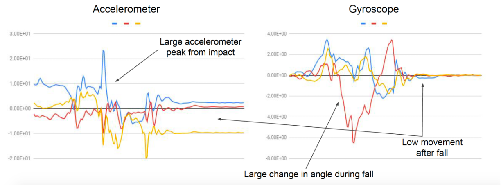

# Class Project - Example and Instructions
{: .no_toc }

## Table of Contents
{: .no_toc .text-delta }

1. TOC
{:toc}
---

# Class Project: Example and Expectations

In the assignments throughout this course, you've worked with carefully curated datasets where the hard work of data collection, cleaning, and labeling was already done for you. However, real-world machine learning projects rarely start with such polished data. This project guides you through the complete process of building a fall detection system from the ground up, introducing challenges you haven't encountered in previous assignments and showing you how to overcome them. This will be useful for you as you think through your project.

## Example project
Our goal is to create a system that can reliably distinguish between different types of human movement, with particular attention to high impact events such as potentially dangerous falls. In the context of this example, we want to look at several key questions that go beyond your previous assignments
* **Defining the classification problem** In your assignments, the classification problem was given to you; here, we want to take a high-level problem and frame it as a classification problem.
* **Events vs Continuous activities** So far, you have looked at continuous activities like walking and running but falls are different in that they are one-time events and not continuous which requires a different data collection and labeling pipeline.
* **Data labeling** How you collect data and label it makes a huge difference to the performance of a classifier. As discussed above, continuous activities are very different from events; in addition, different types of events have different duration (e.g. falling vs sitting down on a chair), so all of these need to be considered carefully when labeling the data
* **Multiple sensors** So far, you have only used features from one sensor i.e. the accelerometer. We will look at how this can easily be extended to add gyroscope features.

## Processing Pipeline Overview



*Figure 1: Overall processing pipeline*

Figure 1 shows an overview of our fall detection system. The system of several key stages that transform raw sensor data into meaningful classifications. Let's examine each major component:

* **Data Collection & Organization**. The pipeline begins with data collection through SensorLogger, gathering samples across three distinct categories: impact events (falls/stumbles), impact-like events (controlled movements), and regular activities. Each category requires different collection strategies which we'll explore in depth later.
* **Data Processing & Windowing**. Raw sensor data undergoes preprocessing and windowing - a crucial step that segments continuous data streams into analyzable chunks. The windowing strategy varies significantly between event-based activities (like falls) and continuous activities (like walking), as we'll discuss in the windowing section.
* **Feature Engineering**. The system extracts three types of features: a) Time-domain statistical features capture basic motion characteristics, b) Peak-based features identify sudden changes and impacts, and c) Frequency-domain features reveal periodic patterns in movement. We'll examine how these features work together to distinguish different types of motion in the feature extraction section.
* **Classification**. The final stage uses a decision tree classifier to categorize movements into our three classes. This classifier learns patterns from our engineered features to distinguish between genuine falls, similar-looking controlled movements, and regular activities. We'll evaluate its performance using confusion matrices and example cases later in this chapter.

The following sections will dive deep into each component, explaining key decisions and implementation details that make this pipeline effective for fall detection.

<details markdown="block">
<summary>How to define the classification problem?</summary>
## Classification Categories

Defining the classification problem isn't as straightforward as it might first appear – the system needs to recognize the difference between someone accidentally falling and someone intentionally sitting down quickly, while also being able to ignore routine movements like walking or standing. To frame this as a classification problem, let us focus on classifying between three distinct classes, each representing different levels of impact and motion patterns:

* **Impact Events**: These are sudden, high-intensity movements characterized by rapid acceleration changes. This category includes hard falls, stumbles, and trips where the body experiences unexpected motion changes. These events typically show distinctive spike patterns in sensor data, making them particularly interesting for detection.

* **Impact-like Events**: These represent controlled movements that may appear similar to falls in sensor data but are intentional actions. Examples include sitting down on the floor, dropping into a chair, or reaching for something on the ground. These movements share some characteristics with actual falls but follow more controlled patterns.

* **Regular Activities**: This category encompasses typical daily movements like walking, standing, or light motion. These activities serve as our baseline and help the classifier understand the difference between normal movement patterns and potential fall events.
</details>

<details markdown="block">
<summary>How to choose appropriate sensors?</summary>
## Sensor Configuration: Accelerometer + Gyroscope

So far you have used only the accelerometer. But linear acceleration alone can be misleading for fall detection. Consider someone quickly sitting down versus falling - both show similar acceleration patterns as the body moves downward. The key difference lies in control: a controlled sitting motion involves deliberate rotation of the body, while a fall often includes uncontrolled rotational motion.

The accelerometer captures the intensity of motion but misses crucial orientation changes. A forward fall, for instance, shows high forward acceleration but also includes body rotation that only the gyroscope can detect. This rotational data helps distinguish between:
1. A forward fall (high acceleration + rapid uncontrolled rotation)
2. Quickly bending down (high acceleration + controlled rotation)
3. Fainting (high acceleration + minimal initial rotation followed by sudden change)

Real-world examples to illustrate this:
- Tripping shows a characteristic pattern: initial rotation (detected by gyroscope) followed by impact (detected by accelerometer)
- Sports activities like jumping can show high acceleration but controlled rotation
- Getting into bed might show similar acceleration to a fall but very different rotational patterns

Without gyroscope data, false positives would be common in daily activities that involve quick movements. The combination of both sensors provides a more complete picture of body motion, significantly improving classification accuracy between actual falls and fall-like activities.



*Figure 2: Example accelerometer (left) and gyroscope (right) signals during a fall event, showing characteristic impact patterns*
</details>

<details markdown="block">
<summary>How to collect and label your data?</summary>
## Labeled Data Collection

One of the key challenges you will face is deciding how to collect and label your data. For this, you will need to first understand the difference between discrete events and continuous activities:

### Discrete Events vs Continuous Activities

* **Discrete Impact Events**: Falls, stumbles, and trips are singular events that occur at specific moments in time. These events have clear start and end points, with a distinct impact moment that we want to capture. For these events, we need to identify and isolate each occurrence specifically.
* **Continuous Activities**: Activities like walking, standing, or general movement are ongoing and don't have natural boundaries. These activities can be recorded in longer continuous segments and later divided into analysis windows, as there's no specific "event" to capture.

For discrete events like falls, we need to capture each instance separately and ensure we have enough examples for training. But what counts as "enough"? Generally, about 50 samples per event type provides a good balance between effort and model performance. This brings us to our first major decision point: how to collect these 50 samples efficiently while ensuring data quality.

### Recording Strategies



*Figure 3: Comparison of batch and individual recording methods for fall data collection*

As shown in Figure 3, we have two main approaches to collecting our fall data. 

* **Batch recording** The batch recording method initially seems more efficient - start recording, perform all 50 falls with short breaks between them, then stop. It's quicker and involves less interaction with the recording device. However, this efficiency comes with hidden costs. When you later process this data, you'll need sophisticated algorithms to identify each fall, separate it from the "getting up" motion, and ensure you haven't accidentally included any unwanted segments. If something goes wrong - if the phone shifts in your pocket or if one fall wasn't performed correctly - you might not discover the problem until much later, potentially compromising a large portion of your dataset.
* **Individual recording** The alternative is individual recording - separate files for each fall. While this means more time spent starting and stopping recordings, it provides immediate quality control. You can verify each recording right after making it and redo it if necessary. The processing is also much simpler: trim a few seconds from the start and end of each recording, and you have your fall event cleanly isolated.

For continuous activities like walking, our approach is quite different.
**Continuous activities**  Here, we're not trying to capture individual events but rather collect enough examples of the activity to represent its natural variation. A single 5 minute recording of walking, for instance, will provide plenty of data once we split it into windows for analysis.

**Recommended Strategy for Students** Given these considerations, we recommend that students use the individual recording method for falls and impact-like events. Yes, it takes more time and you'll handle more files. But the  quality control makes it worthwhile - nothing is more frustrating than discovering problems in your data after you've completed all your recordings. Moreover, this method provides valuable learning opportunities. Each recording becomes a mini-experiment where you can observe the sensor patterns immediately and develop an intuition for what constitutes a "good" recording. This understanding becomes invaluable when you move on to feature extraction and classification.

### Practical Implementation

For falls and impact-like events, establish a consistent recording protocol:
1. Start your recording
2. Wait two seconds to establish a clean baseline
3. Perform the fall or movement
4. Stay still for two seconds to ensure a clean endpoint
5. Stop recording
6. Immediately verify the data quality
7. Label and save the file

For continuous activities, the process is simpler:
1. Start recording
2. Perform the activity naturally for say 5 minutes
3. Stop recording

Remember that safety comes first, especially when recording fall data. Use protective mats, ensure you have enough space, and consider having a spotter present. It's better to take extra time and stay safe than to rush and risk injury.

This structured approach to data collection sets the foundation for everything that follows. Clean, well-organized data makes the subsequent processing and classification tasks much more manageable. In the next section, we'll explore how to take this raw data and transform it into windows suitable for feature extraction.

</details>

<details markdown="block">
<summary>How to select window sizes for events and continuous activities?</summary>
## Window Selection Strategies

Once we've collected our raw sensor data, we face a new challenge: how do we divide this data into meaningful segments for analysis? The answer varies depending on what type of movement we're examining. Figure 4 illustrates how we can handle types of activities.



*Figure 4: Windowing strategies for different activity types, showing how raw sensor data is processed into feature vectors*

* **High-Impact Events**: When dealing with falls and other high-impact events, these events pivot around a crucial moment - the impact - and the window needs to capture not just this moment but the motion leading up to and following it. So you can pick a 5-second window centered on the impact point (±2.5 seconds) to provide a good view of the event. 
* **Impact-Like Events**: Impact-like events such as controlled sitting or deliberate drops might have temporal patterns that are different from that of fall events. Someone carefully lowering themselves to the ground might take twice as long as someone falling, yet both actions need to be correctly classified. So, for each such event, you need to pick a window that is appropriate for its natural duration.
* **Regular Activities**: Walking, standing, and other regular activities require a fundamentally different approach. Without natural start and end points, we impose structure through systematic sampling. One solution is to sliding windows - 5-second segments that overlap by 50\%; you can also try non-overlapping windows. We usually prefer overlapping windows for two reasons. First, it ensures we don't miss important transitions that might occur at window boundaries. Second, it provides our classifier with multiple perspectives on the same movement, improving its ability to recognize patterns. The 5-second duration captures enough cycles of repetitive movements (like walking) to establish clear patterns while remaining short enough to detect activity changes promptly.

In the next section, we'll explore how to extract meaningful features from these windows, leveraging both accelerometer and gyroscope data to capture the full complexity of human movement.
</details>

<details markdown="block">
<summary>How to extract features from multiple sensors?</summary>
## Feature Extraction from Multiple Sensors

With our data properly windowed, we now face the challenge of extracting meaningful features that capture the essence of different movements. While previous assignments focused solely on accelerometer data, our fall detection system leverages both accelerometer and gyroscope signals. This dual-sensor approach provides a richer understanding of movement patterns, as illustrated in Figure 5.



*Figure 5: Feature extraction pipeline showing parallel processing of accelerometer and gyroscope data*

### Time Domain Features

For both sensors, we begin with basic statistical measures that capture the central tendency and variability of the signal. From each axis of both the accelerometer and gyroscope, we compute:
- Mean values that represent average motion intensity
- Standard deviation indicating motion variability
- Maximum and minimum values showing movement extremes
- Root Mean Square (RMS) capturing the signal's overall energy

### Peak Characteristics

Peak analysis becomes particularly interesting when comparing accelerometer and gyroscope data. In a fall event, we typically see:
- Sharp acceleration peaks indicating sudden impacts
- Corresponding rotational velocity peaks showing body orientation changes
- Peak width and prominence that help distinguish controlled versus uncontrolled movements

The relationship between these peaks often helps distinguish between similar activities – for instance, a fall versus a controlled sitting motion might show similar acceleration patterns but very different rotational velocity signatures.

### Frequency Domain Analysis

Transforming both sensor streams into the frequency domain reveals different aspects of the movement:
- Accelerometer frequency features capture repetitive linear motions
- Gyroscope frequency features identify rotational patterns
- Dominant frequencies often differ between sensors for the same activity

### Creating the Combined Feature Vector

The final step concatenates features from both sensors into a single feature vector. In your pandas DataFrame, each row represents one window of activity, with columns clearly labeled by both sensor type and feature:

```python
features_df = pd.DataFrame({
    # Accelerometer features on magnitude
    'acc_mean_x': [...],
    'acc_std_x': [...],
    'acc_peak_height_x': [...],
    'acc_dom_freq_x': [...],
    
    # Gyroscope features on magnitude
    'gyr_mean_x': [...],
    'gyr_std_x': [...],
    'gyr_peak_height_x': [...],
    'gyr_dom_freq_x': [...],
 )
```

**Implementation Tips**  When extending your existing accelerometer-based code to include gyroscope features, follow these two tips:
* **Naming Convention**: Use clear prefixes ('acc_' and 'gyr_') to distinguish features from different sensors. This makes your code more maintainable and helps when analyzing feature importance later.
* **Feature Selection**: Not every feature needs to be calculated for both sensors. Some features might be more meaningful for one sensor than the other. As you develop your system, you can analyze feature importance to determine which combinations work best for your specific classification task.

</details>

<details markdown="block">
<summary>Project submission guidelines</summary>
# Project Submission Guidelines 

## Performance Analysis Requirements

**Classification Results Documentation**
Your project must include a thorough analysis of your classifier's performance. Start with a confusion matrix that clearly shows how well your system distinguishes between different activities or events. Beyond just the numbers, you need to tell the story of your classifier's behavior through visualization. Select representative examples that demonstrate both successful classifications and failure cases - these examples should help explain why your classifier works well in some scenarios and struggles in others. If your project does not involve classification but involves counting or other problem, define your performance metric appropriately. For example, when counting, you can report accuracy and false positives/negatives.

**Feature Engineering Deep Dive**
It would also be good if your submission has a comprehensive analysis of your feature set's effectiveness. Calculate and visualize feature importance scores for all features in your system. Then, conduct experiments with different feature subsets: use only your top three features, separate time-domain and frequency-domain features, and compare these against your complete feature set. This analysis should reveal which features are truly driving your classifier's performance and whether you've struck the right balance in your feature engineering.

## Project Development Guidelines

**Data Collection Standards**
Your project must be grounded in real-world data that you collect yourself using SensorLogger or an equivalent application. While you may supplement this with existing datasets, your own data collection is mandatory. This requirement ensures you understand the practical challenges of data collection and the nuances of your chosen problem. Teams making substantial data contributions to other projects will receive credit for this activity, as this promotes collaboration and creates a richer dataset for everyone.

**Analysis Requirements**
Your analysis must demonstrate clear application of the tools and techniques covered in class while extending beyond basic assignment work. While we would prefer that you come up with a different scenario/problem, if you do end up working on a problem that involves mostly the same sensor/features/code as your assignments, then you should extend your assignment in new ways. This extension could come through a combination of new feature engineering (e.g. try other features that you did not use in the assignment), new sensor combinations (e.g. your assignment only used accelerometer, try with accelerometer and gyroscope now), or deeper analysis of classification results (e.g. visualizing results). Your project should show sophistication in how you approach the problem even if you are building on the assignment(s).

## Project Proposal Requirements

In your project proposal, briefly outline the following aspects.

**Application Concept and Sensors**
Begin your proposal with a clear description of your application and its goals. Detail which sensors you plan to use and why they're appropriate for your problem. Remember that sensor choice should be driven by what you're trying to detect or classify, not just by what's available.

**Data Analysis Strategy**
Outline your planned analysis approach, including initial thoughts on feature engineering and classification methods. What makes your problem interesting from an analysis perspective? What challenges do you anticipate in distinguishing between different activities or events? How will you address these challenges?

**Data Collection Plan**
Develop a concrete plan for data collection that includes your target sample size, how you'll divide data into windows, and your labeling strategy. Consider practical aspects like where you'll collect data, how many participants you'll need, and how you'll ensure data quality. A well-thought-out data collection plan is crucial for project success.

**Evaluation Framework**
Describe how you'll measure success in your project. What metrics will you use beyond basic accuracy? How will you validate your results? Include both quantitative metrics and qualitative assessments in your evaluation plan.

The project proposal should demonstrate that you've thought through the technical challenges and have a realistic plan for completing the project.
</details>

